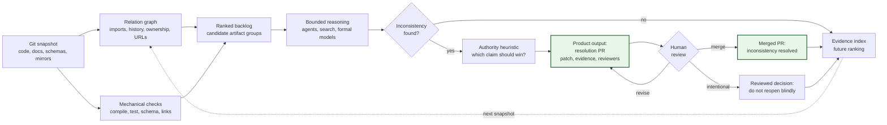

Large repositories need continuous semantic maintenance. A practical inconsistency resolver would treat a Git monorepo as a versioned knowledge base, use deterministic checks where possible, spend bounded agentic and formal-reasoning budget on high-value candidate artifact groups, and open reviewable pull requests that repair drift across code, tests, documentation, schemas, configuration, and mirrored external systems.

## Repository Drift

Large repositories become inconsistent. Documentation stops matching implementation. Comments describe code that no longer exists. Tests encode behavior that product requirements no longer intend. PR descriptions overstate or misstate the change they introduce. Commit messages become weak evidence for future readers. Schemas, feature flags, screenshots, runbooks, dashboards, API clients, generated SDKs, design files, and planning documents all drift at different rates.

This is not only an agentic software engineering problem. Human teams have always had finite attention, incomplete local context, and uneven domain knowledge. Agents make the problem more explicit because their context windows are hard limits: once the relevant artifact is outside the context window, the agent cannot reason about it during that step. In agent-heavy workflows, this can surface as agentic drift: repeated bounded-context edits slowly move the repository away from its intended semantics. The same failure mode exists in large organizations with humans, except the limit is less measurable.

The relevant automation is not a replacement for tests, type checkers, linters, schema validators, or broken-link checkers. Anything that can be detected mechanically should be detected mechanically. The harder problem is semantic inconsistency across artifacts that are individually plausible and often locally valid.

I previously wrote about this in the narrower context of [AI-assisted software requirements engineering](https://terolaitinen.fi/speccing-ai-assisted-software-requirements-engineering). Requirements documents are one useful special case. The general problem is maintaining best-effort semantic consistency across the whole versioned knowledge base around a product.

A Git monorepo is a strong substrate for this. A single commit hash can identify the repository state being analyzed: code, tests, documentation, configuration, schemas, and mirrored third-party artifacts. Git history gives evidence about prior intent. GitHub gives a review workflow, checks, CODEOWNERS, pull request discussions, issue links, requested reviewers, and a natural place for an automated system to propose resolutions. GitHub metadata and external artifacts can be mirrored or indexed against commit hashes to make analysis reproducible. The same idea can be made to work across multiple repositories, but then the system needs a snapshot protocol based on commit hashes, timestamps, release versions, or an external index. The monorepo gives those properties almost for free.

The tool I have in mind is an inconsistency resolver. It watches a repository, detects likely inconsistencies under a bounded compute budget, proposes resolutions as pull requests, asks appropriate people for review, responds to review comments, and keeps the number of open resolution PRs within an organization-defined limit. It is closer to Renovate or Dependabot than to a chat interface: it maintains a ranked backlog of repository hygiene work, but the work item is a semantic inconsistency rather than an outdated dependency.

## Consistency as a Repository Property

Let a repository snapshot be the complete state of a repository at a commit hash, plus any mirrored external artifacts or indexed metadata pinned to that commit. A mirrored artifact may originate from Google Docs, Figma, JIRA, Confluence, Slack, an observability platform, or another system. For the resolver, the important property is not where the artifact was authored. The important property is that a stable representation is available for analysis.

An artifact is any versioned or version-associated unit in the snapshot. Source files, Markdown documents, OpenAPI schemas, protobuf definitions, database migrations, CI workflows, package manifests, ADRs, screenshots, generated clients, feature-flag configuration, event schemas, runbooks, PR descriptions, issue descriptions, and commit messages are all artifacts. A large artifact can be split into fragments: Markdown sections, AST subtrees, functions, classes, type definitions, schema paths, design frames, image regions, or time-bounded transcript segments. The same machinery can then operate recursively at different granularities.

A claim is a proposition or constraint extracted from an artifact or fragment. Some claims are syntactic and should be checked without an agent: a link target exists, an import resolves, a generated client matches its OpenAPI schema, a migration applies, a package lockfile matches its manifest, a feature flag is declared before use. Other claims are semantic: a comment says a function retries three times, a runbook says an alert means a dependency is down, a requirements document says the user can cancel an operation, a PR description says no database migration is required, or a test name says it covers a behavior that the assertions no longer check.

An inconsistency exists when a set of claims cannot all be true under the interpretation that matters for the repository. More formally, for a repository snapshot `S`, an extraction process `E`, a set of claims `C = E(S)`, and a chosen interpretation model `M`, a subset `G` of `C` is inconsistent if there is no model `m` in `M` satisfying every claim in `G`.

Contradictions and omissions should be distinguished. A contradiction is a direct incompatibility: one artifact says retries happen three times while the implementation retries once. An omission is a missing expected consequence: an API schema adds a required field, but the public migration guide, generated client, or compatibility test is not updated. Contradictions are usually easier to explain and should generally rank higher. Omissions are still valuable findings, but the resolver must justify the rule that makes the missing artifact expected.

This definition is intentionally relative to the extraction process and the model. The resolver does not access truth directly. It observes artifacts, derives claims, chooses an approximate model, and tests whether the claims can be satisfied together. Better parsers, better metadata, better semantic extraction, and better formal reductions improve the useful approximation.

The interesting cases are not always pairwise. A set of `N` claims may be consistent while adding one more claim makes the set inconsistent. This is the familiar shape of satisfiability problems: each individual constraint may look harmless, and every pair may be satisfiable, while the whole set is not. Therefore, testing only pairs of artifacts is both wasteful and incomplete. It is wasteful because a repository with `k` artifacts has `O(k^2)` pairs and most pairs are unrelated. It is incomplete because some inconsistencies require three or more artifacts to observe.

The general problem is undecidable once claims can encode arbitrary program behavior. Even weaker versions can be computationally expensive. An inconsistency resolver must therefore be explicitly best-effort. It should not claim to prove repository consistency. It should allocate a fixed or dynamically adjusted token and compute budget to find high-value inconsistencies and propose useful resolutions.

## Problem Specification

The resolver operates on a stream of repository snapshots. For each snapshot it may run deterministic checks, extract metadata, update indexes, select candidate groups of related artifacts, test those groups for inconsistency, rank findings, and open resolution pull requests. The output is not a binary statement that the repository is consistent. The output is a managed backlog of suspected inconsistencies and proposed fixes.

### Inputs

The problem has the following inputs:

- A versioned repository snapshot identified by a Git commit hash.
- Mirrored representations of external artifacts when the authoritative source is outside Git.
- Repository metadata: file paths, folder hierarchy, ASTs, imports, symbol definitions and references, package manifests, dependency graphs, schemas, migrations, test names and assertions, CI workflows, feature flags, configuration, environment-variable references, ownership files, issue keys, URLs, comments, commit messages, PR descriptions, review comments, screenshots, telemetry schemas, runtime traces, and runbooks.
- Git and GitHub metadata: commit graph, merge graph, pull request history, review history, blame, CODEOWNERS, changed-file sets, issue links, labels, authors, reviewers, timestamps, and branch topology.
- Organization policy: severity rules, protected areas, reviewer selection rules, maximum concurrent resolver PRs, acceptable automation permissions, authority rules, and budgets for deterministic checks, agentic analysis, search, and formal solving.

### Resolution Pipeline

The end-to-end lifecycle is straightforward even if the individual steps are hard:

- Normalize repository files, mirrored artifacts, and GitHub metadata into analyzable artifacts and fragments.
- Run deterministic consistency checks and remove anything ordinary tooling can decide.
- Build or update the relation graph over artifacts, fragments, claims, authors, history, and runtime evidence.
- Rank candidate groups of related artifacts under the current budget.
- Extract claims from the selected group and test them using structural checks, agent analysis, search, and bounded formal models.
- Classify the finding, estimate confidence and severity, and choose the most plausible authority ordering.
- Open a pull request only when the proposed resolution clears the configured trust threshold.
- Incorporate review feedback, merged patches, closed PRs, and prior review decisions into future analysis.

### Mechanical Checks First

The resolver must first separate mechanically checkable inconsistencies from semantic inconsistencies. Mechanical structural checks should run through deterministic tooling: compilers, type checkers, linters, test runners, schema validators, migration validators, generated-code diff checks, link checkers, dependency validators, and static analysis. Agentic or formal reasoning should be reserved for cases where ordinary tooling cannot express the relevant consistency relation.

### Relation Graph

The resolver must build a relation graph over artifacts, fragments, and claims. Useful edges include explicit links, imports, symbol references, URL references, issue identifiers, PR references, schema references, generated-from relationships, test-target relationships, folder proximity, co-change history, ownership, author expertise, temporal adjacency in the git graph, review participation, runtime dependency, semantic similarity, and search-index neighborhood. Some edges are precise, such as an import. Some are probabilistic, such as semantic similarity between a runbook section and an alerting rule. The graph is not the answer; it is the structure used to decide what to test next.

### Graph Bootstrapping

The graph is the resolver's main leverage point, so bootstrapping matters. If the graph is sparse, the resolver misses higher-order conflicts. If the graph is too dense, probabilistic noise overwhelms candidate ranking.

The resolver should start from the repository as it exists. It should not require a new consistency metadata standard, because that standard would become another artifact that can drift out of sync. If the repository already has links, CODEOWNERS, ADRs, comments, generated-file markers, package boundaries, schema references, ownership conventions, issue identifiers, or folder structure, those are useful inputs. They are not privileged truth.

Existing explicit references should usually produce higher-confidence graph edges than inferred semantic proximity. But they remain claims or evidence, not axioms. A stale code comment pointing to a canonical document, an obsolete ADR, or an inaccurate ownership convention can itself be the inconsistency the resolver should find.

### Candidate Ranking

The resolver must rank groups of related artifacts before spending expensive reasoning budget. Ranking matters more than the raw consistency test. A naive all-pairs strategy spends most of its budget on unrelated files and still misses higher-order conflicts. A practical resolver should prefer groups that have strong graph connectivity, recent change activity, known user impact, previous inconsistency findings, ownership ambiguity, high fan-in, high fan-out, executable interfaces, generated artifacts, external mirrors, or repeated review friction.

Candidate selection should account for transitive consistency. If fragment `A` is related to `B`, and `B` is related to `C`, testing only `{A, B}` and `{B, C}` may miss a conflict between `A` and `C`. The resolver should sometimes expand a candidate group to the local graph neighborhood or to a bounded closure over high-confidence edges. The expansion must still be budgeted; otherwise the resolver recreates the impossible global-consistency problem at a smaller scale.

### Fragment-Level Analysis

The candidate group does not have to be a set of whole files. Large files should be split into fragments and analyzed at the smallest useful level. A Markdown document may contribute only one section. A TypeScript file may contribute one exported function and its imports. A Figma export may contribute one frame. A runbook may contribute one alert section. Internal links between fragments of the same file should be represented like links between files.

### Consistency Tests

For each selected group, the resolver can apply multiple consistency tests:

- Structural tests expressed as ordinary deterministic checks.
- Retrieval-augmented agent analysis over the selected artifacts and relevant history.
- Cross-examination between independently generated summaries or claim sets.
- Translation of selected claims into a coarse formal model that can be checked by a bounded SAT, SMT, Datalog, type-system, or domain-specific solver.
- Comparison against runtime traces, telemetry schemas, screenshots, generated artifacts, or other executable evidence.

### Bounded Formal Models

The formal reduction is useful only if it is coarse enough to finish inside the budget. The goal is not to encode the whole repository in a perfect formal system. The goal is to project a selected slice of repository knowledge into a model that can cheaply answer one bounded question. A lossy reduction can still be valuable if it finds inconsistencies that ordinary tests and unconstrained language-model reasoning miss.

### Finding Classification

When the resolver identifies a likely inconsistency, it must classify and rank it before acting. Classification can combine built-in rules with organization-specific policy. A conflict between implementation and stale documentation is usually different from a conflict between implementation and a security requirement. Implementation is often the de facto specification, but not always the desired one. The latest change is often the best evidence of current intent, but not when it accidentally violated an older invariant. History, review discussion, author expertise, affected paths, runtime evidence, and ownership all matter.

### Authority Heuristic

The resolver should not have a single global source of truth. It needs an authority heuristic for each finding. The heuristic estimates which claim most likely represents current organizational intent and which artifact should change.

For an initial rollout, code and executable evidence should usually anchor descriptive claims about current behavior. If a Markdown file says the system behaves one way and production code, tests, traces, and schemas agree on another behavior, the first proposed fix should usually update the Markdown file. That avoids agents rewriting working systems based on aspirational or stale prose.

This default must be overridable. A dedicated requirements or specification folder can be authoritative for intended behavior when the organization explicitly says so. Security requirements, regulatory constraints, API compatibility contracts, product commitments, or accepted ADRs may outrank current implementation. In those cases, the resolver may propose code, test, schema, migration, or configuration changes instead of documentation changes.

The authority heuristic should consider artifact type, recency, runtime evidence, tests, explicit links already present in the repository, CODEOWNERS, review history, author role, domain expertise, blame, linked issues, release status, and whether the conflicting claim came from a merged PR, a draft plan, or an obsolete document. It should also admit uncertainty. When authority is ambiguous, the resolver should open an issue, draft PR, or low-confidence finding rather than silently choosing a side.

### Resolution Pull Requests

The resolver should then propose the most plausible resolution as a pull request. The PR should include evidence: the inconsistent artifacts or fragments, the claims believed to conflict, why the proposed side is treated as authoritative, what alternative resolutions were considered, and which checks were run. The patch may change code, tests, comments, documentation, schemas, generated artifacts, configuration, runbooks, or mirrored artifacts. If an external system remains authoritative, the repository PR can update the mirror and include instructions or generated patches for the upstream source.

### Reviewer Selection

Reviewer selection should be data-driven. CODEOWNERS gives a baseline. Git blame identifies recent and historical contributors. PR review history identifies people who previously approved the relevant behavior. Issue links and labels can identify product or domain owners. Author tagging can encode explicit domain expertise. The resolver should request review from people likely to know the intended behavior, not merely people who touched adjacent files most recently.

### Budget and Concurrency

The resolver should operate with bounded concurrency. Like dependency update automation, it should avoid flooding the organization with low-confidence PRs. An organization might allow at most a small number of open resolver PRs per repository, per team, or per severity class. The budget can be dynamic: if the resolver is finding high-confidence inconsistencies, increase analysis budget in the affected area; if it is producing false positives or stale findings, reduce budget or change ranking weights.

### Trust and Noise Control

Semantic inconsistency PRs are more expensive to review than dependency updates. A dependency PR has a familiar reason and a narrow diff. A semantic PR asks the reviewer to load context across multiple artifacts and decide which claim represents intent. The resolver must earn trust early.

The first rollout should bias toward high-confidence contradictions with small, evidence-rich patches. Low-confidence findings should stay out of the PR queue until the resolver has enough positive review history. They can be logged, batched into reports, or opened as issues. The first few PRs matter disproportionately: hallucinated or low-signal findings train developers to ignore the tool.

Every PR should minimize reviewer effort. It should state the conflicting claims, link exact artifact fragments, explain the authority heuristic, show why the change is safe, list checks run, and keep the patch small. If the reviewer has to reconstruct the resolver's reasoning from scratch, the PR has already failed as automation.

### Review Feedback Loop

The resolver must close the loop after opening a PR. Review comments are additional artifacts and should be incorporated into the next analysis step. If a reviewer says the proposed resolution is wrong, the resolver should update the claim graph and propose a different patch or close the PR with a recorded reason. If a reviewer asks for a narrower change, the resolver should make it. If a PR is merged, the merge commit becomes evidence for future intent.

If a human closes a finding as intentional, the closed PR and review comments become evidence for future runs: this apparent inconsistency was known and accepted in that context. The resolver can use that as a negative claim when ranking future findings, but it should not become an unquestionable suppression rule. If relevant artifacts change, or if the earlier review decision conflicts with newer evidence, the resolver may revisit it. Otherwise it will rediscover the same inconsistency and reopen the same PR, turning semantic maintenance into noise.

### Non-Goals

Several non-goals are important. The resolver does not guarantee global consistency. It does not eliminate the need for human review. It does not replace deterministic tooling. It does not make commit messages perfectly repairable after the fact. It does not turn every external system into a well-behaved source-controlled artifact without integration work. Its value is more modest and more practical: under a bounded budget, continuously find and repair inconsistencies that would otherwise require manual cleanup projects, institutional memory, or accidental discovery during unrelated work.

### Operational Meaning of Eventual Consistency

Eventual consistency in this context means that repeatedly observable, high-value inconsistencies should eventually be selected, analyzed, and either resolved or recorded as intentionally unresolved, assuming they remain within the configured budget and access permissions. The guarantee is operational rather than mathematical. The repository still contains ambiguity, stale information, and false beliefs. The resolver makes those states less stable.
