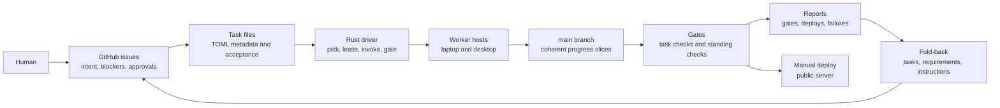

This is a work-in-progress side-project setup for me, at most 4 worker hosts, 1 public box, and 1 monorepo. The aim is to maximize AI subscription usage and hardware usage while minimizing my oversight.

The constraints are model limits, context windows, CPU, RAM, disk, GPU availability, build caches, local datasets, deployment targets, public-server capacity, and my attention. The setup schedules those constraints explicitly.

The rest of this document specifies the mechanisms that satisfy these requirements.

## Requirements

1. Maximize multiple AI subscriptions.

   Models have different strengths, rate limits, latency, and tool integrations. I assign the preferred model or subscription for each task. The setup maximizes subscription usage by keeping suitable tasks ready for different agents, not by automatically rerouting an in-flight task.

2. Maximize hardware utilization.

   The two local machines and the public server have different resource profiles. Work routes to whichever host has the required CPU, RAM, disk, datasets, or GPU. The public server should stay small and stable.

3. Support an unreliable worker fleet.

   Any worker host may be offline, asleep, rebooting, rate-limited, busy, or out of disk. Work must resume from repo state.

4. Use GitHub issues as my interface.

   I open issues to request work. Agents open issues when they need decisions, hit blockers, or need deploy intent confirmed. I receive email notifications for new issues and replies. GitHub issues render Mermaid, which lets agents break complex concepts into diagrams without a custom UI.

5. Keep every commit on `main` in a working state.

   Everything lands on `main` for simplicity. Progress commits are allowed only when they preserve a coherent working slice: touched-unit tests pass, generated artifacts are consistent, task metadata is valid, and the repo is not knowingly red. Task completion additionally requires the standing gate and task acceptance checks.

6. Prevent duplicate and conflicting work.

   Leases prevent duplicate task execution. Repository scopes prevent concurrent overlapping edits when everything lands on `main`.

7. Conserve tokens.

   Agents read task files, local `AGENTS.md`, requirements, small summaries, and compact reports. Raw logs, datasets, generated artifacts, and unrelated source trees stay on disk unless needed.

8. Codify memory bounds.

   Bounded memory is a requirement. Agents must implement streaming algorithms, chunked data structures, bounded queues, pagination, sampling, online aggregation, and retention rules where data can grow.

9. Route by host capabilities.

   Tasks declare CPU, RAM, dataset, OS, and duration requirements. Hosts declare capabilities. GPU acceleration is an optional host speedup, not a task requirement. Noninteractive agents always run inside the hardened devcontainer.

10. Keep public operation separate from experimentation.

    The public box serves the app, runs bounded live workloads, receives deploy artifacts, and exposes health checks. It does not run agents.

11. Improve instructions from observed failures.

    Failures and surprises become typed records, session summaries, follow-up tasks, `AGENTS.md` edits, requirement changes, or safety-rule changes. Instruction changes require my confirmation.

## Topology

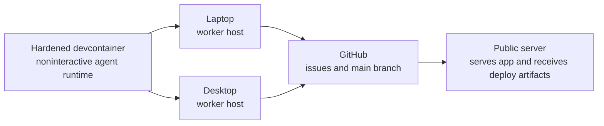

The laptop and the desktop are both worker hosts. I use whichever one I am at — the laptop when travelling, the desktop at home. Both run agents inside the hardened devcontainer and push commits to `main`. The router assigns tasks based on declared resources and which host is online, not by fixed role.

The public server is a CX22-class VPS. It serves the public app, stores public operational state in SQLite3 and DuckDB, and receives deploy artifacts. It is outside the agent fleet.

Agent execution is containerized consistently. Linux uses Docker and the devcontainer directly. WSL2 uses Docker inside the Linux environment. macOS uses Docker. Native host processes are for interactive local work, not unattended YOLO agents.

## Monorepo Shape

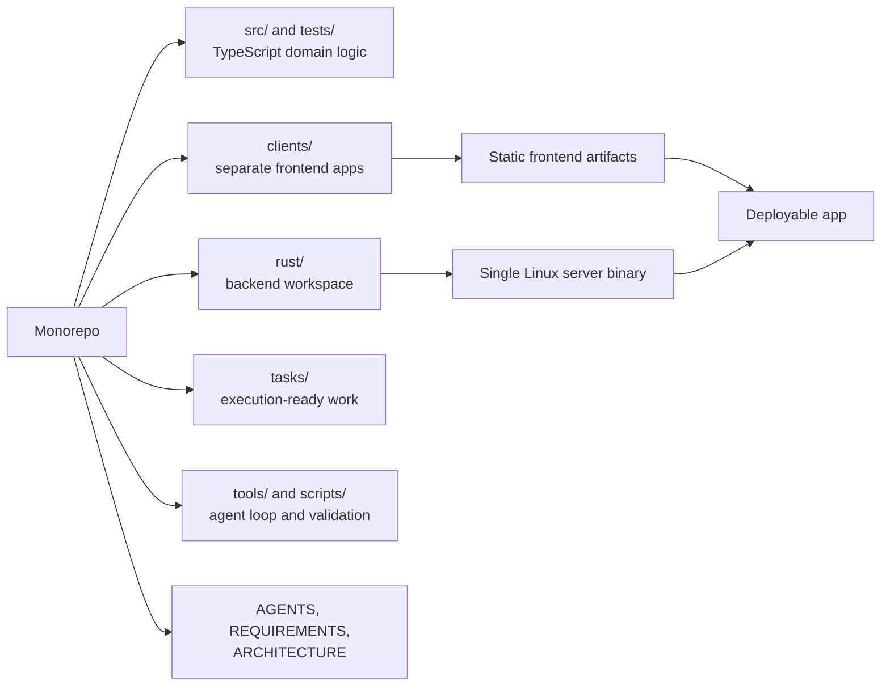

The backend is one Rust workspace that builds into one deployable Linux server binary. Product-specific backend modules live behind explicit project boundaries. Shared infrastructure stays shared. Project policy stays local.

Frontends are separate TypeScript clients. Each frontend owns its requirements, build, tests, and UI contract. Next.js frontends build to static artifacts that the backend can ship or serve. A Storybook component library keeps shared UI components inspectable, testable, and cheap for agents to modify without loading the full application.

The monorepo also contains tasks, agent-loop tooling, requirements, architecture notes, `AGENTS.md`, prompts, summaries, reports, and deployment scripts. Cross-project changes are visible in one diff. Deployment can build one backend artifact and the changed frontend artifacts.

`AGENTS.md` files are hierarchical operating manuals. The root file defines repository-wide rules. Nested files define local boundaries: frontend clients, Rust crates, storage, engine, UI, tests, and deployment scripts. Agents read the parent and local `AGENTS.md` files for touched paths. This keeps context scoped without losing local rules.

## Model Roles

Current assignment preferences:

- Claude Opus 4.7: orchestration, specification, interactive architecture
- Codex GPT-5.5: hard implementation
- Kimi K2.6: routine implementation, chores, metadata, fold-back work

The assigned model is recorded in the lease. If the model hits a rate limit, the run stops at the next coherent working slice when possible. It does not switch to another model automatically.

## Driver Core

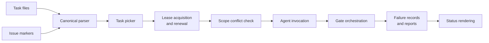

The driver is a portable Rust binary in the workspace. Shell scripts are launch adapters only. The driver owns:

- task metadata parsing
- issue marker parsing
- task picking
- lease acquisition and renewal
- scope conflict detection
- agent invocation
- gate orchestration
- failure record writing
- status reporting

This avoids shell-specific behavior across Linux, WSL2, and macOS.

## Task Format

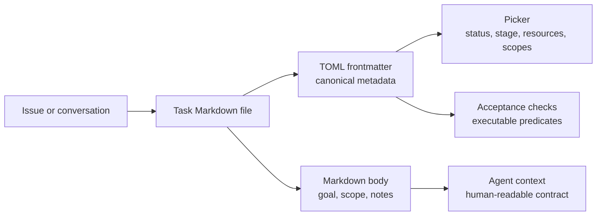

Tasks are Markdown files with TOML frontmatter. The frontmatter is the canonical metadata; prose is for me and agents.

```markdown
+++
id = "APP-042"
status = "open"              # open | completed | abandoned
stage = "ready"              # ready | in_progress | blocked | discussion_pending | done
kind = "impl-hard"           # spec | impl-hard | impl-routine | chore | experiment | meta-audit | meta-fold
priority = "high"
repos = ["clients/app", "rust/crates/project-app"]
repo_scopes = ["clients/app/src/search/**", "rust/crates/project-app/src/search/**"]
depends_on = ["APP-037"]
blocked_on = ""
source_issue = "https://github.com/owner/repo/issues/123"
speculative = true

[resources]
required_hosts = ["desktop"]
min_memory_gb = 32
min_free_disk_gb = 50
needs_local_dataset = true
max_wall_clock_minutes = 120

[acceptance]
checks = [
  "cargo test -p project-app search_large_fixture_peak_rss --release",
  "npm run test:client:app -- search",
]
+++

# APP-042 Search index streaming refactor

## Goal

Refactor search indexing so input size does not determine peak memory.

## Scope

- Replace full-list materialization with chunked streaming.
- Preserve existing API response shape.

## Counter-Case

- The current index may already be bounded by upstream pagination.
- The memory spike may be caused by report rendering, not indexing.
- A streaming refactor may add latency that matters more than peak RSS.

## Acceptance Notes

- Synthetic 5M-row fixture stays below 2 GB peak RSS.
- Existing search UI tests remain green.
```

Acceptance criteria must include at least one executable predicate: test name, script exit code, benchmark threshold, generated report check, or deploy health check. Prose-only acceptance criteria are not sufficient for autonomous completion.

`+++` is intentional TOML frontmatter. The parser treats it as the only task metadata block; fenced TOML inside the Markdown body is not metadata.

If `speculative = true`, the body must contain `## Counter-Case`. The gate fails if the section is missing.

Tasks are narrow contracts. Related work becomes a follow-up task. Missing or contradictory requirements become a spec task or GitHub question.

## Lease Protocol

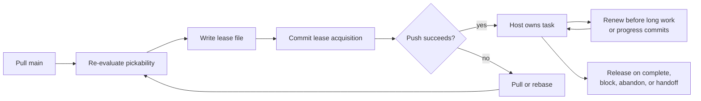

Each task lease is a file named `tasks/<TASK-ID>.lease.json`.

```json
{
  "task_id": "APP-042",
  "host": "desktop-1",
  "pid": 44122,
  "model": "codex-gpt-5.5",
  "acquired_at": "2026-05-06T12:00:00Z",
  "expires_at": "2026-05-06T18:00:00Z",
  "repo_scopes": ["clients/app/src/search/**"]
}
```

Acquisition is a commit-and-push:

1. Host pulls `main`.
2. Host re-evaluates task pickability.
3. Host writes `tasks/<TASK-ID>.lease.json`.
4. Host commits `lease: acquire <TASK-ID> on <host>`.
5. Host pushes.
6. If push collides, host pulls/rebases, re-evaluates pickability and scope conflicts, and tries another task if needed.

TTL is 6 hours. A host renews the lease on every progress commit and before starting a gate step expected to exceed 30 minutes. Renewal updates `expires_at` through another commit-and-push.

Any host may reclaim a stale lease after `expires_at` through `lease: takeover <TASK-ID> from <old-host>`. Takeover requires rechecking task stage, repo scope conflicts, and latest commits on `main`.

Release deletes the lease file in the same commit that completes, blocks, abandons, or hands off the task.

Lease files are the fleet status surface. They answer which tasks are active, which host owns them, which model is running them, and when takeover is allowed. Idle hosts do not need to advertise liveness; the loop is opportunistic, and inactive capacity is not a correctness problem.

Before every progress commit, the driver fetches `origin/main`, reads the lease file, and aborts if the lease is no longer owned by the current `{host, pid, model}`. It then writes a `lease_takeover` failure record and stops. This prevents the original host from pushing over a takeover after a long step.

## Main-Only Concurrency

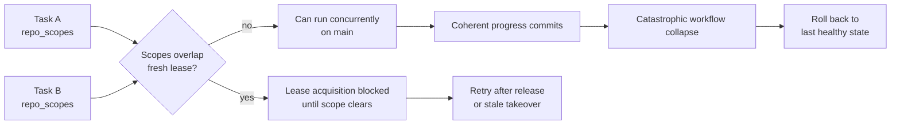

All progress lands on `main`. To make that viable, overlapping repository scopes prevent simultaneous lease acquisition.

A task's `repo_scopes` are `globset` patterns with gitignore-style `**` semantics. A host may not acquire a lease if any fresh lease has intersecting scopes. Broad scopes are allowed but reduce concurrency. If a task cannot predict its scope, it must declare a broad scope and serialize with more work.

Each host runs at most one agent at a time. The driver also serializes per model subscription: only one active agent per `(host, model)` for rate-limited models. Agents do not resolve merge conflicts mid-task as a normal path. If a push conflict occurs, the driver pulls/rebases before the agent starts or after a coherent progress commit. If the rebase creates a semantic conflict, the task becomes blocked and the agent opens a GitHub issue.

This keeps main-only simple without pretending overlapping autonomous edits are safe. It also creates a terrible git history. Lease commits, progress commits, gate metadata, report updates, task bookkeeping, and small recovery commits all land directly on `main`. That is an accepted cost of making repository state the operational truth for a small side-project fleet.

The catastrophic failure mode is explicit. If leases, scopes, gates, rebase churn, or repeated partial progress interact badly enough, the workflow may collapse instead of merely producing a messy history. Recovery is then to roll back to the last healthy state, abandon or recreate stale leases, record the failure, and re-seed work from requirements, issue state, and surviving reports.

## GitHub Issue Protocol

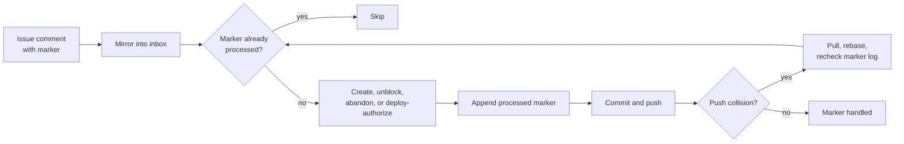

Every host can poll issues, but issue marker handling is idempotent.

Polling:

- interval: 5 minutes for active hosts
- source: GitHub issues and comments updated since the host's last sync cursor
- mirror: `inbox/issues/<issue-number>.md`
- cursor: committed under `fleet/issue-sync/<hostname>.json`

Issue handling:

- I am the only person with repository access.
- Agent-authored issues are labeled `agent-question`.
- Deploy requests require my `/deploy` marker.
- GitHub issues can contain Mermaid diagrams, so agents can explain task graphs, state machines, architecture changes, and failure analysis visually in the same async channel.

Markers:

- `/scoped <project>` creates or confirms a task
- `/proceed` unblocks a task
- `/discuss` keeps it in discussion
- `/abandon` abandons the task or issue
- `/deploy` authorizes deployment after completion

Idempotency:

- each processed marker is recorded as `{issue, comment_id, marker, sha}` in `inbox/processed-markers.jsonl`
- a host checks this log before acting
- processing a marker is a commit-and-push
- on push collision, the loser pulls/rebases and rechecks the processed-marker log

This prevents two hosts from creating duplicate tasks from the same `/scoped` comment.

Five-minute polling is an intentional scale tradeoff. Deploy approval may wait until the next poll.

## Hardened Devcontainer

Noninteractive agents run inside a network-hardened devcontainer on every worker host.

The default devcontainer may talk to GitHub and the public box. Package registries are added only for tasks that need dependency installation.

## Task State

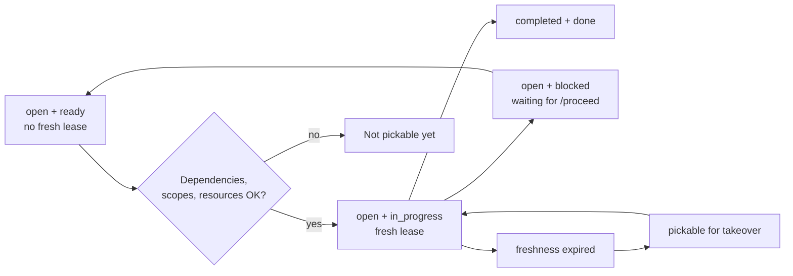

Pickability is determined only by:

- `status`
- `stage`
- lease presence
- lease freshness
- dependency completion
- repository scope overlap
- host resource compatibility
- issue marker state

Everything else is derived. A task with `status = "open"`, `stage = "in_progress"`, and a fresh lease is owned by that lease. The same task with a stale lease is pickable for takeover. A task with `stage = "ready"` and no fresh lease is pickable if dependencies, scopes, and resources allow it. A task with `stage = "blocked"` is not pickable until I write `/proceed`.

The picker, status renderer, and gate use the same canonical task parser and this state table.

## Resume Contract

Each task kind defines what a resuming agent reads before continuing.

- `impl-hard`: task file, linked requirements, local `AGENTS.md`, latest relevant commits, last gate report, touched module tests.
- `impl-routine`: task file, local `AGENTS.md`, latest commits, focused test output.
- `chore`: task file, affected metadata files, validation script output.
- `experiment`: task file, experiment plan, data snapshot ID, last report, host resource telemetry.
- `meta-fold`: session summaries since last fold, failure records, target instruction files; must open a GitHub issue and wait for `/proceed` before changing standing instructions.
- `meta-audit`: requirements, tasks, implementation paths, prior audit result; outputs findings or tasks, not automatic instruction changes.

Resume contracts are the operational expression of token discipline: agents read what the contract names, nothing else by default. The next agent does not rediscover the task from scratch.

## Methodology

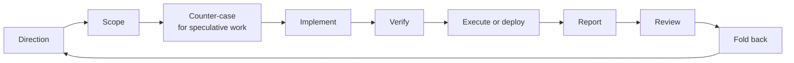

The side-project loop is:

1. Direction: I open an issue or start a conversation.
2. Scope: agent turns it into a task or asks a bounded question.
3. Counter-case: speculative work gets a failure-mode note before implementation.
4. Implement: worker changes the smallest evidence-producing slice.
5. Verify: focused checks, task acceptance checks, standing gate.
6. Execute: deploy if I wrote `/deploy`; otherwise run the experiment or benchmark on the right host.
7. Report: compact result artifact plus resource telemetry.
8. Review: I accept, reject, refine, or abandon.
9. Fold back: failures and surprises update tasks, requirements, or instructions after my confirmation.

The same pattern works for UI experiments, data pipelines, backend refactors, performance work, product features, and infrastructure changes.

The `Counter-Case` step is enforced only for tasks marked `speculative = true`.

## Commits And Interruption

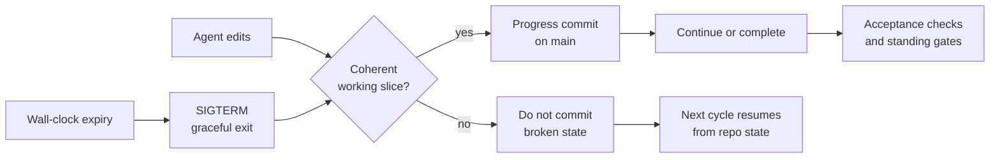

A progress commit must preserve a coherent working slice:

- touched-unit tests pass, or the task records why they cannot run
- generated files match sources
- task metadata is valid
- no known broken state is committed
- remaining work is explicit

Task completion requires both:

- per-task acceptance checks from frontmatter
- standing gate checks selected by diff paths and task kind

If an agent is interrupted mid-edit, it should not commit broken files. The next cycle starts from `main`, task metadata, issue history, reports, and summaries.

If `max_wall_clock_minutes` expires, the driver sends SIGTERM to the agent, waits for graceful exit, releases or renews the lease according to whether a coherent progress commit exists, and writes a `resource_exhaustion` failure record.

## Gates

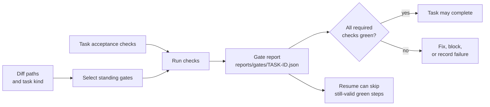

Standing gates include:

- formatting
- type checks
- unit tests
- integration tests
- boundary checks
- client builds
- Storybook builds for component-library changes
- forbidden-pattern scans
- diff-size budgets
- reproducibility checks
- deployment smoke tests for deployment-facing changes

Gate reports live under `reports/gates/<TASK-ID>.json`.

Long gates are resumable at the report level. A gate step records command, input hash, started_at, finished_at, status, and log path. If a host dies mid-gate, the next host reruns incomplete or invalidated steps and may skip still-valid green steps. Gate runs do not create progress commits by themselves.

Completion requires green task acceptance checks and green standing gates.

There is no separate agent review step. That is deliberate: the current goal is to preserve token budget for implementation and gate improvement. These side projects are not mission critical and do not have external users, so small breakages and quirks are expected and acceptable. When they show up, I improve the gates so the same class of issue is less likely to recur.

## Bounded Memory

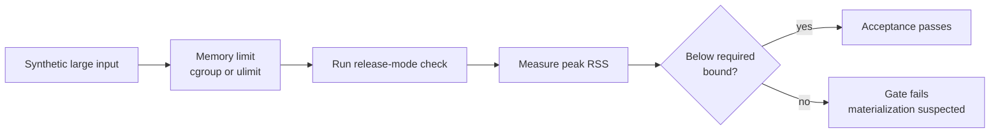

Every growing data path needs a release-mode memory test.

Pattern:

- generate synthetic large input
- run under cgroup memory limit or `ulimit -v`
- record peak RSS
- assert peak RSS below the requirement
- fail if the path materializes full input, full history, all users, all artifacts, or all trials without an explicit bound

Example acceptance check:

```bash
cargo test -p project-app search_large_fixture_peak_rss --release
```

Memory limits are part of the product contract. They are not comments.

## Hardware Utilization

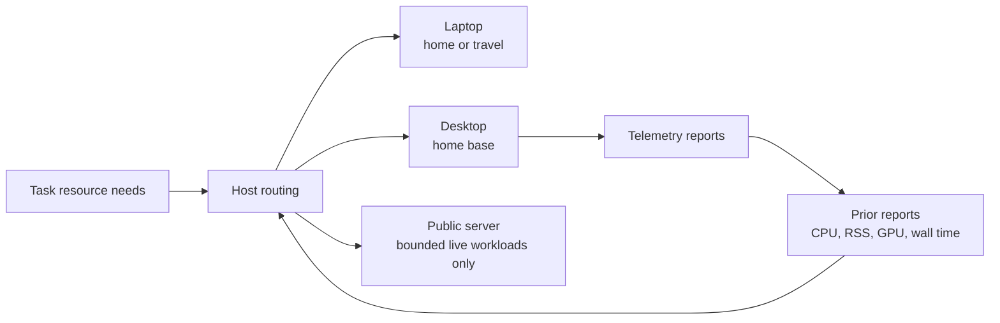

Reports for heavyweight work include:

- CPU seconds
- wall-clock seconds
- peak RSS
- GPU seconds
- GPU device name
- host
- model
- task ID

`cpu_seconds / wall_clock_seconds` shows effective CPU parallelism. Peak RSS tells the router where future work belongs. GPU seconds show whether an optional accelerated path ran.

Full builds, release builds, Docker image builds, full gates, large migrations, and large experiments are serialized per host or pinned to one host class. Parallel agents are useful for scoping, code search, independent edits, focused tests, summarization, and follow-up task generation.

## Platform-Specific Optimization

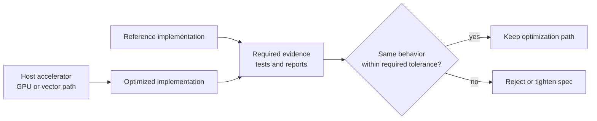

Agent labor lowers the cost of platform-specific optimization. CPU vectorization, CUDA, Metal, DirectML, Vulkan, ROCm, or OS-specific adapters can be cheap enough to try if they are written behind a reference implementation.

Tasks do not require a GPU backend. They require a reference behavior and bounded resources. If a host has a useful accelerator, the implementation may use it as an optimization path.

Optimized paths may change runtime. They must not change evidence.

Strict numerical paths require bitwise equality against the reference path. Approximate equality is allowed only when requirements define the tolerance and tests enforce it.

## Deployment

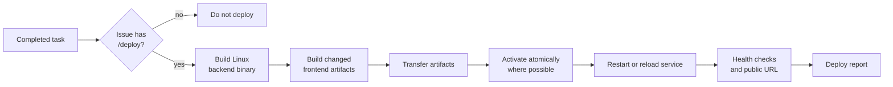

Deployment is explicit and issue-confirmed.

The backend deploy artifact is a Linux server binary. Builds happen in Linux-capable environments: Linux, WSL2, or a macOS-hosted Linux VM.

I do not use GitHub Actions for deployment. The Rust workspace is large enough that a cold build in GitHub Actions timed out at 60 minutes, and the free CI minute budget would not sustain frequent builds. The public server is a small CX22 VPS, so it cannot build the backend itself. Each worker host keeps a warm `target/` cache, which makes building the Linux binary and deploying directly from a host practical.

Frontend artifacts build separately and ship with the backend or as static assets.

Deploy procedure:

1. Build backend artifact for the public-server target.
2. Build changed frontend artifacts.
3. Transfer artifacts to the public server.
4. Activate atomically where possible.
5. Restart or reload the service.
6. Run health checks.
7. Verify the public URL.
8. Write deploy report under `reports/deploys/<TASK-ID>.json`.

Agents deploy only after I write `/deploy` on the task issue.

## Failure Records

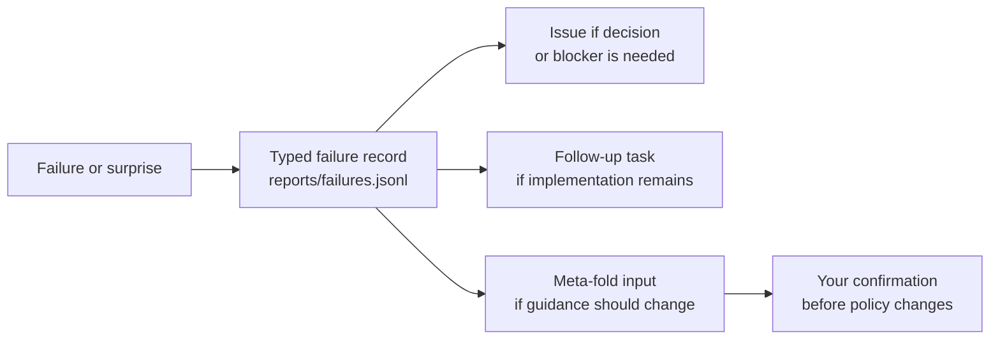

Failures are typed records in `reports/failures.jsonl`.

Types:

- `rate_limit`
- `gate_red`
- `scope_creep`
- `dependency_blocked`
- `prompt_injection_suspected`
- `resource_exhaustion`
- `lease_takeover`
- `merge_conflict`
- `deploy_failed`
- `unknown`

Each record includes task ID, host, model, failure type, command if any, log path, issue if opened, and next action. Typed failures make retrospective fold-back tractable.

## Self-Improvement

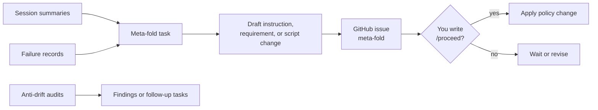

Instruction changes require my confirmation.

Meta-fold tasks read session summaries and failure records, draft changes to `AGENTS.md`, safety rules, requirements, or scripts, open a GitHub issue labeled `meta-fold`, and wait for my `/proceed`. They do not self-merge standing instruction changes.

Anti-drift audits compare requirements, tasks, implementation, gates, and `AGENTS.md`. They produce findings, follow-up tasks, or issues. They do not silently rewrite policy.

The loop can improve itself, but the policy layer has my checkpoint.

## Security

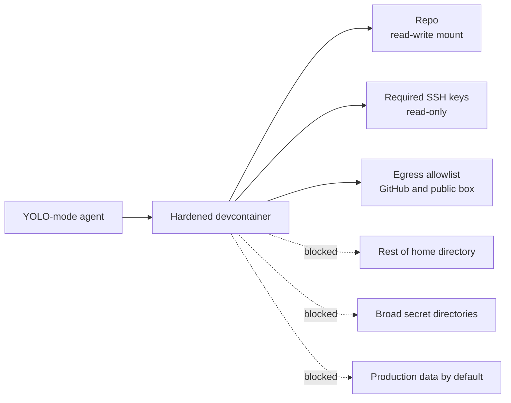

Noninteractive workers run inside the network-hardened devcontainer on every worker host. A YOLO-mode agent always runs inside this container.

Boundary:

- repo mounted read-write
- required SSH keys mounted read-only
- known hosts pinned
- memory, CPU, and PID limits
- Linux capabilities dropped
- `no-new-privileges`
- hostname allowlist
- iptables egress firewall
- default network access only to GitHub and the public box

The container does not receive the rest of the home directory, unrelated SSH keys, shell history, other projects, production data by default, or broad secret directories.

This is containment, not proof. A YOLO-mode agent with git credentials and
network access is still a serious actor. I will revise the security 
setup if I ever have something worth protecting running in production.

## Next Steps

The initial version is implemented. It remains to actually operate it and iron out the kinks. As long as the basic loop works and agent workers are able to push commits to the repo without breaking it, I can nudge them to improve guardrails and the setup itself. I will also periodically conduct a manual agent-assisted meta review of the setup and the methodology.
