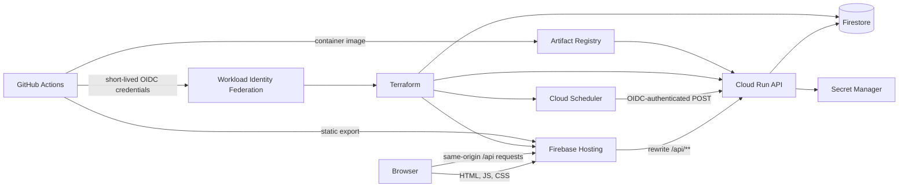

In [my first post about Family Ledger](/vibe-coding-experiments-with-opus-4-6-and-codex-5-3/), I described a deployment optimized for one cheap virtual machine. Several applications shared an Nginx reverse proxy, one Rust binary, one SQLite database, one Google OAuth setup, and one operating-system lifecycle on the smallest Hetzner Cloud instance.

That arrangement minimized the number of billable resources. It also coupled unrelated applications. Changing Family Ledger required rebuilding and restarting their shared gateway. A deployment defect in any application could affect all of them. Database tables were application-specific, but the database file, backup procedure, host access, and release path were shared.

Hetzner's price increase prompted me to reconsider the fixed monthly server, but cost was not the only reason to extract Family Ledger. The application receives only a few requests per day and performs one weekly background action. That workload does not justify a continuously running server or a shared release lifecycle.

The replacement had nine constraints:

- Family Ledger needed its own private repository and Google Cloud project.
- The browser and API needed one origin so cookies and cross-origin policy stayed simple.
- The API needed to scale to zero between requests.
- Weekly allowances needed to run without a continuously running process.
- Google sign-in needed an explicit parent allowlist, initially containing only my account.
- GitHub Actions needed to plan and apply Terraform without a stored Google service-account key.
- Terraform needed to own infrastructure, while a separate deployment workflow owned application releases.
- The existing SQLite ledger needed to migrate without importing users belonging only to other applications.
- Normal usage needed to remain within Google Cloud's free service allowances.

The explicit deployment target was the Google Cloud free tier. At a few requests per day, runtime usage should remain orders of magnitude below the relevant allowances. This is still a design target rather than a guarantee: free allowances have location, billing-account, and usage conditions.

Family Ledger records virtual allowances; it does not hold or move real money. Correct balances and private family records matter, but a cold start or short outage is only an inconvenience. That context favors low recurring cost and simple recovery options over reserved capacity and paid availability features.

## Resulting Architecture



The frontend is a Next.js 16 static export hosted by Firebase Hosting. Static export avoids a frontend server, and Hosting can serve immutable assets from its CDN. A custom domain, `family-ledger.terolaitinen.fi`, points to the Firebase site.

Firebase Hosting rewrites `/api/**` to a Cloud Run service in `europe-north1`. The browser therefore sees one HTTPS origin even though Google runs the static and dynamic parts on different products. The final catch-all rewrite returns `index.html` for client-side routes.

The API is a Node.js 22, TypeScript, and Express container. Cloud Run uses request-based billing, one vCPU, 256 MiB of memory, CPU idling, zero minimum instances, and a configured maximum of two instances. The application has no reason to scale aggressively, so two instances leave ample capacity without normally allowing accidental traffic to create many instances. [Cloud Run can briefly exceed a configured maximum during a traffic spike](https://cloud.google.com/run/docs/configuring/max-instances), so this setting limits ordinary autoscaling rather than imposing a hard quota.

Firestore Native mode stores application data in the multi-region `eur3` location. Cloud Scheduler runs in `europe-west1` because Cloud Scheduler is not available in `europe-north1`. Its only job sends an OIDC-authenticated `POST` to the Cloud Run allowance endpoint at 00:00 UTC every Monday.

Secret Manager holds the session-signing secret. Artifact Registry holds API container images and deletes images older than 14 days. These retention policies matter because idle compute can be free while forgotten storage grows indefinitely.

## Designing for the Free Allowances

The few daily requests are negligible compared with Google's free allowances. The relevant calculation is not an average monthly estimate alone; each service has a separate allowance and a separate way to become billable.

### Cloud Run

The API uses request-based billing, zero minimum instances, a configured maximum of two instances, one vCPU, and 256 MiB of memory. The [monthly free allowance is 180,000 vCPU-seconds, 360,000 GiB-seconds, and 2 million requests](https://cloud.google.com/run/pricing), aggregated by billing account. A traffic spike, slow request, or request loop could exceed compute or request allowances, so scaling to zero is paired with a low maximum-instance setting.

### Firestore

The project has one Native-mode database, with point-in-time recovery disabled. The [daily free allowance includes 50,000 reads, 20,000 writes, and 20,000 deletes](https://cloud.google.com/firestore/pricing), together with 1 GiB of storage and 10 GiB of monthly outbound transfer. Only one database per project receives the free quota. Polling, inefficient queries, index growth, backups, point-in-time recovery, or sustained use can become billable.

### Firebase Hosting

Firebase Hosting serves the static export and proxies same-origin API requests. Its no-cost allowance includes [10 GB of stored content and 10 GB of monthly data transfer](https://firebase.google.com/docs/hosting/usage-quotas-pricing). Large assets or unexpected public traffic are the main ways this application could exceed that allowance.

### Cloud Scheduler

The deployment uses one weekly job. [Three jobs per billing account are free](https://cloud.google.com/scheduler/pricing); the count is account-wide rather than project-wide.

### Secret Manager

The deployment keeps one active session-secret version. The free allowance includes [six active versions and 10,000 access operations per month](https://cloud.google.com/secret-manager/pricing), aggregated by billing account. Old versions therefore need intentional removal if the secret is rotated repeatedly.

### Artifact Registry

The Docker repository deletes images older than 14 days. Artifact Registry includes [0.5 GB of free storage per billing account](https://cloud.google.com/artifact-registry/pricing), so image size and release frequency still matter despite the small application workload.

### Terraform State

The versioned Terraform state bucket is in the EU and retains at most 20 archived versions. Cloud Storage's Always Free storage applies only in `us-west1`, `us-central1`, and `us-east1` according to [Cloud Storage pricing](https://cloud.google.com/storage/pricing). The EU state bucket is therefore a small billable exception to the free-tier target, even though its state objects are tiny.

The architecture reduces fixed cost by matching products to the work. Static files need storage and transfer, API calls need request-time compute, the ledger needs transactional storage, and the weekly action needs one scheduled invocation. No resource needs a continuously allocated CPU.

Cold starts are reasonable for this workload. A family member may wait for a new Cloud Run instance after a period of inactivity, but the application does not need enough latency consistency to justify paying for an idle minimum instance.

As a secondary warning, Terraform configures a EUR 4 monthly budget alert at 50, 90, and 100 percent; the alert reports spend but does not cap it. The maximum instance count, storage cleanup policies, and disabled paid data-protection features are the controls that limit accidental spend.

## A Repository Boundary, Not a Code Extraction

The old Family Ledger frontend lived under `clients/family-ledger` in a monorepo. Its backend handlers lived inside a Rust gateway that also served other applications. Copying those directories into a new repository would have preserved dependencies on a deployment model that no longer existed.

I instead treated the move as a rewrite against the existing product behavior. The new repository contains three npm workspaces:

```text
apps/web       Next.js static frontend
apps/api       Express API and Firestore adapter
tools/migrate  SQLite export validation and Firestore import
infra/state    Terraform state-bucket bootstrap
infra/bootstrap Workload identity and deployment identity
infra/terraform Application infrastructure
```

The product remained narrow: parents invite children, create errands, post deposits and withdrawals, configure weekly allowances, and inspect balances and transaction history. Shared gateway abstractions, server provisioning, and unrelated user records had no place in the new repository.

The rewrite also established a clean ownership boundary. Domain calculations and input validation can run without Firestore. HTTP parsing, Google token verification, Firestore access, and scheduled invocation remain adapters around that logic. This matters more in a serverless system because local unit tests should not require cloud credentials or paid resources.

## Bootstrapping Terraform Without Permanent Credentials

Terraform cannot use a remote state bucket before that bucket exists, and GitHub cannot use workload identity federation before its pool, provider, service account, and IAM bindings exist. The repository therefore has three Terraform roots with different bootstrap responsibilities.

### 1. Create the Project and State Bucket

The project and billing association are the two operator-owned prerequisites. In outline, the initial commands are:

```bash
gcloud projects create "$PROJECT_ID"
gcloud billing projects link "$PROJECT_ID" \
  --billing-account="$BILLING_ACCOUNT_ID"

terraform -chdir=infra/state init
terraform -chdir=infra/state apply
```

The state root starts with local state and creates an EU Cloud Storage bucket with uniform bucket-level access, enforced public-access prevention, versioning, and `force_destroy = false`. A lifecycle rule retains no more than 20 archived object versions.

The application root currently passes `SESSION_SECRET` to `google_secret_manager_secret_version.secret_data`. Marking a Terraform variable as sensitive hides it from normal output but does not remove it from state, so the current and archived state objects contain the session secret. The state bucket must therefore be treated as secret-bearing storage, not only as deployment metadata. A better revision would pass an ephemeral Terraform input to the provider's write-only [`secret_data_wo`](https://registry.terraform.io/providers/hashicorp/google/latest/docs/resources/secret_manager_secret_version) argument and advance `secret_data_wo_version` on rotation, or let Terraform create only the Secret Manager container and add secret versions outside Terraform. Until then, rotating the secret also requires accounting for archived state versions.

After the bucket exists, the backend configuration is changed from local to GCS and the bootstrap state is migrated:

```bash
terraform -chdir=infra/state init \
  -migrate-state \
  -backend-config="bucket=$TF_STATE_BUCKET" \
  -backend-config="prefix=family-ledger-state-bootstrap"
```

The state bucket is infrastructure, but its initial creation cannot be delegated to infrastructure that depends on it. Keeping this exception in a small root makes the trust transition explicit.

### 2. Create GitHub's Federated Identity

The bootstrap root enables the APIs needed for IAM, billing, service usage, and storage. It creates a workload identity pool and GitHub OIDC provider, a `family-ledger-gha` service account, and the IAM bindings needed by the workflows.

The provider maps GitHub's OIDC claims and accepts tokens whose repository-name claim equals `tlaitinen/family-ledger`:

```hcl
attribute_mapping = {
  "google.subject"       = "assertion.sub"
  "attribute.actor"      = "assertion.actor"
  "attribute.repository" = "assertion.repository"
  "attribute.ref"        = "assertion.ref"
}

attribute_condition =
  "assertion.repository == 'tlaitinen/family-ledger'"
```

The service-account binding repeats that repository-name restriction with a principal set keyed by `attribute.repository`. GitHub requests an OIDC token during a workflow, and [Google exchanges it for short-lived credentials](https://cloud.google.com/iam/docs/workload-identity-federation-with-deployment-pipelines); no service-account JSON key is stored in GitHub.

This removes permanent keys but is not the strongest WIF boundary. The repository name is mutable, and although `ref` is mapped, the condition does not test it. The same administrative service account is used for pull-request plans and writes from `main`, so any workflow eligible for this provider receives the same Google identity. [Google recommends numeric `repository_id` and `repository_owner_id` claims because names can be reused](https://cloud.google.com/iam/docs/workload-identity-federation-with-deployment-pipelines#define_an_attribute_mapping). A stronger revision would trust those numeric claims, give pull-request plans a read-only identity, and reserve a separate write identity for the protected deployment environment and `refs/heads/main`.

The deployment service account has broad administrative roles inside the dedicated project because it creates APIs, IAM bindings, Firebase resources, Cloud Run, Firestore, Scheduler, Artifact Registry, and secrets. The dedicated project limits where those permissions apply, but it does not compensate for the shared plan-and-apply identity. Splitting those identities is worthwhile even for this small application because the change is confined to bootstrap Terraform and workflow configuration.

This bootstrap step runs once from an authenticated operator environment. Afterward, GitHub Actions can plan and apply both the bootstrap and application roots.

### 3. Create the Application Infrastructure

The application root enables the APIs required by Artifact Registry, Cloud Scheduler, Firestore, Firebase, Cloud Run, and Secret Manager. It then creates:

- the Firebase project, Hosting site, and custom domain;
- the Firestore database;
- the Artifact Registry repository and cleanup policy;
- the session secret and its initial version;
- separate API and Scheduler service accounts;
- the Cloud Run service and its runtime IAM permissions;
- and the weekly Cloud Scheduler job.

The Cloud Run runtime account receives `roles/datastore.user` and access to only the session secret. The Scheduler account has no database role. The API verifies the scheduler token's service-account identity before running the allowance batch.

Terraform initially creates Cloud Run with a placeholder image, but it ignores subsequent changes to the container image:

```hcl
lifecycle {
  ignore_changes = [
    template[0].containers[0].image,
  ]
}
```

This line defines ownership rather than hiding drift. Terraform owns the service configuration, IAM, environment, scaling, and secret reference. The deployment workflow owns the application revision. Without the ignore rule, a later Terraform apply could roll Cloud Run back to the placeholder or an older image recorded in Terraform state.

## GitHub Repository Configuration

The workflows read one repository variable and six GitHub secrets:

```text
Variable: GCP_PROJECT_ID

Secrets:
GCP_BILLING_ACCOUNT_ID
TF_STATE_BUCKET
GCP_WORKLOAD_IDENTITY_PROVIDER
GCP_SERVICE_ACCOUNT
GOOGLE_CLIENT_ID
SESSION_SECRET
```

The workload identity provider and service-account email are identifiers rather than credentials, but storing them with the other deployment settings keeps the workflow interface small. The session secret is a high-entropy random value. The OAuth client ID is public to browsers by design; its server-side importance is that the API accepts tokens only for that audience.

The repository has three workflows:

1. CI runs on every pull request and push to `main`.
2. Terraform plans changed infrastructure and applies it on `main` or an explicitly approved manual dispatch.
3. Deploy builds and publishes the application when application paths change on `main`, or when manually dispatched.

CI installs from the lockfile, checks Prettier, runs type-aware ESLint with zero warnings, type-checks every workspace under strict TypeScript settings, runs Knip for unused files and dependencies, executes Vitest, builds all workspaces, runs `npm audit --omit=dev --audit-level=high`, builds the API container, and validates all three Terraform roots.

The deployment workflow repeats the complete application quality gate before authenticating to Google. This ordering is deliberate. `google-github-actions/auth` writes a temporary `gha-creds-*.json` file into the workspace; when authentication originally ran first, Prettier discovered that generated file and failed the deployment. Running quality checks before cloud authentication removes generated credentials from the source-quality input.

After validation, the workflow exchanges its GitHub OIDC token, builds an image tagged with the commit SHA, pushes it to Artifact Registry, deploys that exact image to Cloud Run, and deploys the static export to Firebase Hosting. Concurrency groups prevent overlapping deployment or Terraform runs.

## Google Sign-In and the Session Boundary

Google OAuth clients belong to a Google Cloud project and cannot simply be reassigned as part of a Terraform state move. I created a new web client under the Family Ledger project, configured the deployed JavaScript origin, placed its client ID in GitHub, and reapplied Terraform before redeploying both applications.

The browser uses Google Identity Services to obtain an ID token. It sends that credential to the API, which verifies the signature, issuer, expiry, and audience against the dedicated client ID. The current implementation normalizes the email and then applies application authorization:

- an existing parent or invited child may sign in;
- a new parent may be created only when the email appears in `PARENT_EMAIL_ALLOWLIST`;
- a child account becomes linked only through an invite for that exact email address.

Authentication and authorization are separate checks. A valid Google identity proves control of the Google account, but the current email lookup is not a stable identity binding. [Google says to identify an account by the immutable `sub` claim rather than email](https://developers.google.com/identity/gsi/web/guides/verify-google-id-token). Google is authoritative for `@gmail.com` addresses and for verified Workspace addresses with an `hd` claim; for a non-Gmail account without `hd`, `email_verified` means Google verified the address when the account was created, not that Google remains authoritative for the mailbox.

The initial parent allowlist contains a Gmail address, but child invitations are not restricted to Gmail or Workspace. The next authentication revision should use email only to locate an allowlist entry or pending invitation. On first acceptance it should atomically bind the token's `sub` to the internal user through a unique `usersByGoogleSubject` index, then use `sub` for subsequent sign-ins and retain email as mutable profile and invitation data. Claiming an existing non-Gmail account should require confirmation beyond `email_verified`, such as approval by the parent who issued the invitation. Until that binding exists, email changes and non-Gmail invitations remain limitations of the current implementation.

After authorization, the API issues a 24-hour session containing the internal user ID and expiry, signed with HMAC-SHA-256. The cookie is `HttpOnly`, `Secure`, and `SameSite=Strict`. Mutating endpoints also reject requests whose origin does not match the application origin.

The cookie name is `__session`, which is a Firebase Hosting constraint rather than a naming preference. My first implementation used `family_ledger_session`. Login returned 200 and the browser stored a valid cookie, but the next dashboard request returned 401. Calling Cloud Run directly with the same cookie succeeded. [Firebase Hosting strips most cookies from rewritten requests and forwards the specially reserved `__session` cookie](https://firebase.google.com/docs/hosting/manage-cache#using_cookies). Renaming the cookie fixed the deployed path.

That behavior is why the authentication check included the custom domain and Hosting rewrite. A successful direct Cloud Run request does not prove that the deployed path preserves the authentication state.

## Firestore Data Model and Ledger Invariants

The Firestore model separates identity lookup, family ownership, ledger entries, and idempotency records:

```text
users/{userId}
usersByEmail/{normalizedEmail}
parents/{parentId}
children/{childId}
children/{childId}/transactions/{transactionId}
invites/{inviteId}
pendingInviteEmails/{normalizedEmail}
errandTemplates/{errandId}
allowanceBatchRuns/{weekKey}
rateLimits/{key}
```

Email lookup uses explicit index documents because the current authentication flow begins with an email while authorization and ownership use immutable internal IDs. Pending-invite index documents make invite acceptance independent of collection scans. The planned Google-subject index belongs alongside these indexes; it is not present in the deployed schema yet.

Each child document stores the current balance for efficient dashboard reads. The transaction subcollection remains the source of the ledger history. Creating a deposit, withdrawal, allowance, or errand reward writes the transaction and updates the child's denormalized balance in one Firestore transaction. This keeps the displayed balance and its corresponding ledger entry consistent without adding repair logic for partial writes.

The API computes monetary values as integer cents. It does not use binary floating-point numbers for ledger arithmetic. The migration similarly recomputed every child balance from imported transactions instead of trusting the cached SQLite balance.

The weekly allowance operation is idempotent per child and week. The Scheduler endpoint determines which weekly periods are due, writes one allowance transaction for each missing period, and records the batch marker transactionally. Retries and delayed invocations therefore converge on the same ledger rather than duplicating money.

Rate-limit documents live in Firestore so multiple Cloud Run instances share the same counters. An in-memory limiter would reset on cold starts and diverge when two instances were active.

Firestore point-in-time recovery is disabled because it is outside the free allowance. The database resource uses an `ABANDON` deletion policy so removing the Terraform stack does not also remove the virtual allowance history. Infrastructure can be recreated, while deleting application data remains a separate action.

## Migrating the Shared SQLite Database

The source was the live SQLite database on the Hetzner host. The migration tool connects over SSH, asks SQLite to create a consistent temporary backup, copies that backup locally, and removes the remote copy in a `finally` path. It never reads the live database file while the old service may be writing to it.

The old `users` table was shared by applications. The exporter therefore selected only users referenced by Family Ledger parents, children, and invites. This filter prevented unrelated identities from crossing the new project boundary.

Export and import were separate commands. The intermediate JSON file was ignored by Git because it contained private family data. Separating the stages allowed validation and a dry run before any Firestore write.

The dry run checked every relational edge that Firestore would no longer enforce automatically:

- every parent and child referenced an exported user;
- every child referenced an exported parent;
- every invite and errand referenced an exported parent;
- every transaction referenced its parent, child, and optional errand;
- every email normalized to the same key used by the runtime;
- every amount converted to integer cents;
- and every child's computed transaction sum matched the imported balance.

All legacy primary keys were remapped to UUIDs. The importer rewrote every foreign reference through the same maps, created normalized email indexes, and converted historical allowance markers into the new idempotency records. Remapping avoided carrying source-system ID assumptions into the new store.

The migrated dataset contained:

```text
users                 4
parents               2
children              2
invites                2
errand templates       3
transactions         235
allowance batch runs  17
child balances         2
```

The complete import fit within one Firestore batch. The tool caps batches at 450 writes so it stays below Firestore's 500-operation batch limit when the dataset grows. For this migration, one atomic commit meant a failed import could not leave half of the ledger in Firestore.

After import, I queried Firestore independently of the migration input and compared collection counts and recomputed balances. I then invoked the Scheduler endpoint with its configured OIDC identity. It returned 200, and the transaction count remained 235 because the current week's allowance had already been recorded. That unchanged count was the expected idempotency result.

## Cutover Sequence

The order kept the one-time data copy and DNS switch easy to reason about:

1. Create the dedicated Google Cloud project and attach billing.
2. Bootstrap the Terraform state bucket locally and migrate its state to GCS.
3. Apply workload identity and IAM bootstrap resources from the operator account.
4. Add the GitHub variable and secrets, then verify CI and Terraform plans in GitHub Actions.
5. Create the dedicated Google OAuth web client and configure its deployed origin.
6. Apply application Terraform, including Hosting, Cloud Run, Firestore, Scheduler, secrets, and cleanup policies.
7. Deploy the API image and static frontend from GitHub Actions.
8. Disable the old allowance job, put the old application into a coordinated write freeze, and record the cutover time.
9. Take the final SQLite export, validate it, and confirm that no old-system writer has run since the freeze.
10. Import the validated dataset and compare Firestore counts and balances.
11. Create the DNS CNAME from `family-ledger.terolaitinen.fi` to `tlaitinen-family-ledger.web.app` and wait for Firebase's managed certificate.
12. Exercise sign-in, session restoration, dashboard reads, and the scheduled OIDC path through the custom domain without creating a new ledger entry.
13. Exercise one write path and record its transaction ID and time as the point after which routing-only rollback is no longer valid.
14. Remove Family Ledger traffic from the old gateway after the new ingress, data, and write checks pass.

Before step 13, both stores represent the same frozen snapshot, so rollback means restoring the old route and lifting its write freeze. After the first Firestore write, returning to SQLite requires freezing the new application, selecting every Firestore transaction created after the recorded cutover time, and applying those entries to SQLite exactly once before restoring the route. For this few-user application that reconciliation could be manual, but fixing the new deployment forward is simpler unless the defect affects data writes.

## Details Found During Deployment

Five provider and integration details only became visible in the deployed environment.

### Firestore API Provisioning

Firestore resource creation failed despite the Datastore API being enabled. Native Firestore provisioning also required `firestore.googleapis.com`, so the application root now enables both APIs explicitly.

### Scheduler Region

Cloud Scheduler could not use the API's `europe-north1` region because Scheduler is unavailable there. Cloud Run remains in Finland, while the Scheduler job runs in `europe-west1`.

### Generated Credentials in Quality Checks

The deployment quality gate failed after cloud authentication because the authentication action generated a JSON credential file that Prettier scanned. The workflow now completes source checks before authenticating.

### Dedicated OAuth Client

Google sign-in was blocked before reaching the application because the original OAuth client belonged to the old project and lacked the new origin configuration. A dedicated client in the Family Ledger project now owns the deployed origin, and both the frontend and API use its client ID.

### Firebase Session Cookie

Login succeeded, but every authenticated API request through the public domain returned 401 because Firebase Hosting did not forward the custom cookie name. The session now uses Firebase's reserved `__session` cookie, and authentication tests exercise the complete Hosting rewrite path.

Each change made an implicit provider or ingress requirement explicit in code, configuration, or deployment order.

## Checks and Practical Tradeoffs

Before switching fully to the new deployment, I checked that all three GitHub workflows were green, Terraform had no unintended changes, Firebase reported the custom domain and managed certificate as active, and the custom-domain health endpoint returned 200.

Authentication was tested as a sequence rather than a button click: Google credential exchange returned 200, the browser received `__session`, the session endpoint returned the expected user, and the dashboard endpoint returned 200 through Firebase Hosting. The Scheduler job was manually executed with its configured OIDC identity. Firestore collection counts and balances matched the validated migration output.

For a family utility used a few times per day, the practical compromises are modest. The first request after an idle period can be slower, unusual public traffic could consume free quotas, and the EU Terraform state bucket can produce a small charge. The deployment account also has broad roles within this one dedicated project. Firestore has no paid point-in-time recovery; I can add periodic exports later if the virtual allowance history warrants the additional storage and automation.

The remaining technical cleanup is specific: bind Google accounts by `sub` after the initial email-based invitation, split read-only planning from write-capable deployment identity, match WIF on numeric GitHub IDs and the deployment ref, and keep future session-secret values out of Terraform state. None of these changes requires a different runtime topology or user workflow.

The new system replaces one cheap, continuously running machine with several managed products, but it does not reproduce the shared gateway in cloud form. Each component now corresponds to one requirement, scales according to that requirement, and has a clear point at which usage becomes billable. Family Ledger can be built, deployed, and eventually removed without touching another application.

That independence is the main result of the migration. The free allowances make the current operating cost small; the repository, project, identity, data, and release boundaries make the application maintainable.
