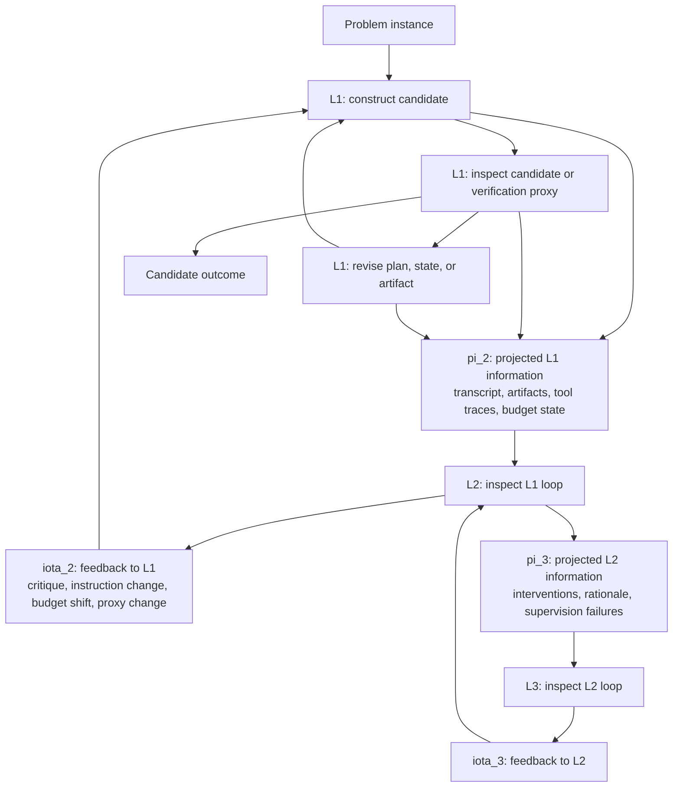

I do not mean "does it work better on today's benchmarks." I mean the structural question. Fix the model, tools, context windows, projection rules, and resource budget. Under that fixed setup, are there problems solvable by a second-order agentic loop that are not solvable by a first-order loop? Are there problems solvable by a third-order loop that are not solvable by a second-order loop? Or does the hierarchy collapse, either immediately or after a small finite number of levels?

A projection rule is the mapping from a lower loop's run state to the information exposed upward: full transcript, summarized transcript, tool traces, diffs, failed attempts, candidate artifacts, budget counters, or some deliberately restricted view. Holding that mapping fixed matters because changing what a higher-order loop can see may change the problem being studied.

This is an analogy to the polynomial hierarchy in computational complexity theory, not a claim that the same machinery applies unchanged. The polynomial hierarchy is built from alternating existential and universal quantifiers over polynomial-size witnesses. Informally, the first existential layer asks "is there a certificate?" A second layer can ask "is there a move such that for every countermove, a predicate accepts?" Higher levels keep nesting `exists` and `for all`. The common belief that the polynomial hierarchy does not collapse is the belief that these nested alternations define strictly stronger decision-problem classes, rather than being reducible to one fixed level. The agentic version is less clean. The "oracle" at each level is not a formal quantifier. It is a language model instance with bounded context, stochastic behavior, tools, memories, and an ability to make judgment calls about another loop's work.

## Agent Loops

A first-order agent loop is the object-level cycle in the opening diagram: construct a candidate, inspect it against whatever evidence is available, revise the plan, state, or artifact, and repeat until the loop submits a candidate outcome.

The word "validate" should not be read narrowly. Some problems have automated tests, type checkers, proof checkers, simulations, or objective scoring functions. Many important problems do not. A software agent may have to build a verification proxy before the real external verification is available. A robotics agent may only get a physically meaningful answer after acting in the world. A product-strategy agent may ultimately be judged by humans, revenue, law, safety, or long-delayed operational behavior.

For this discussion, a problem is any task where an agent can submit a candidate outcome and some evaluator eventually determines whether the outcome is acceptable. The evaluator may be an automated predicate, a human, a market, a physical system, a legal process, an organization, or a proxy chosen by the agent because the real evaluator is expensive or unavailable during the run.

This definition is intentionally broad. It makes formal reasoning harder, but excluding hard-to-verify tasks would remove the cases where agentic metacognition may matter most.

## Higher-Order Loops

A second-order agent loop observes a first-order loop and injects a feedback signal into it. It may read the first-order transcript, inspect artifacts, review failed attempts, detect repeated errors, modify the plan, allocate budget, strengthen a verification proxy, or decide that the first-order loop is stuck.

A third-order loop does the same thing to the second-order loop. It reviews how the reviewer is reviewing. It may detect that the second-order loop is overfitting to a weak proxy, suppressing useful exploration, spending too much budget on style-level critique, or failing to notice that the first-order loop has already changed the problem representation.

More generally, an `n`-th order loop observes some projection of the `(n - 1)`-th order loop and injects some control signal back into it.

The projection matters. A higher-order loop does not necessarily see the lower loop's full internal state. It may see a full chat transcript, a compressed summary, tool traces, diffs, failing tests, candidate artifacts, budget counters, evaluator outputs, or a deliberately adversarial slice. Let `pi_i` be the projection from level `i - 1` to level `i`.

The injection matters too. A higher-order loop may emit natural-language critique, modify the lower-level instructions, create new subtasks, terminate bad branches, adjust budgets, change validation proxies, ask for external feedback, or directly edit a working artifact. Let `gamma_i` be the controller at level `i`, and let `iota_i` be the mechanism that applies its output to level `i - 1`.

The tower is therefore not defined only by the model. It is defined by the tuple:

```text
(M, T, B, pi_2...pi_n, gamma_2...gamma_n, iota_2...iota_n, S)
```

where `M` is the base model or model family, `T` is the available tool set, `B` is the resource budget, and `S` is the scheduling semantics. The scheduling semantics specify whether higher levels run after lower-level work packages, concurrently as streaming coaches, or according to another protocol.

## A Model-Dependent Complexity Class

The natural class definition is model-dependent. Let `A_n(M, B, P)` be the class of problems solvable by an `n`-level agentic tower using model `M`, total budget `B`, and tower protocol `P`.

The budget may include tokens, model calls, tool calls, wall-clock time, physical trials, human-review requests, money, context-window capacity, and persistent-memory writes. For stochastic models, "solvable" should include a success probability threshold, for example at least `2/3` under the problem distribution and evaluator. For adversarial problem instances, the threshold needs to be stated over model randomness rather than over a task distribution.

With a finite total budget, the tower cannot be infinite in any operational sense. If every non-idle level must spend some positive amount of budget to read a projection, run a controller, and inject feedback, then fixed `B` imposes a maximum number of active levels. Above that depth, additional levels are idle, empty, or funded by taking budget away from lower levels. The meaningful finite-budget question is therefore not whether an endless tower survives. It is whether some additional nontrivial level, before the budget ceiling is reached, changes what can be solved compared with spending the same `B` in fewer levels.

For a fixed finite `B`, the hierarchy candidate is only meaningful up to the largest active depth that the budget and protocol can pay for:

```text
A_1(M, B, P_1) <= A_2(M, B, P_2) <= ... <= A_K(M, B, P_K)
```

where `K` is the budget-imposed ceiling for non-idle levels. Writing an infinite sequence beyond `K` only makes sense if the extra levels are allowed to idle, in which case they do not add operational depth.

The inclusion is not automatic unless the higher-order protocol can simulate the lower-order one with acceptable overhead. If a second-order tower is forced to spend nonzero budget on supervision even when supervision is useless, it may solve fewer problems under a tight budget than the first-order loop. A cleaner definition allows higher levels to remain idle, which gives monotonicity by construction.

There is also an unbounded version:

```text
A_n(M, infinity, P)
```

This can be treated as the union over finite budgets, with an added halting requirement. The class asks whether the `n`-level tower can eventually solve a problem if total budget is not the limiting factor. The model still has a fixed context window. The tower can run more calls, create more summaries, write more external memory, test more candidates, and run more meta-review cycles, but each individual model invocation remains bounded by the model's context limit.

The unbounded version is not automatically trivial. A first-order loop with persistent memory may try to simulate a second-order loop by writing its own transcript, rereading it, and producing self-feedback. Whether that counts as second-order behavior depends on the protocol. If the protocol gives the first-order loop the same ability to schedule fresh context windows against its own history, the hierarchy may collapse by simulation. If higher-order levels have privileged projections, independent context windows, different interruption rights, or different scheduling semantics, the simulation argument is weaker.

Unbounded does not mean omniscient. A terminating protocol still needs a stopping rule. It may exhaust the finite transcript and artifact set produced so far, but it cannot exhaust all possible objections to an open-ended problem unless the problem class supplies a finite search space or a complete verifier.

## The Hierarchy Question

After separating out that trivial finite-budget ceiling, there are three basic possibilities for the nontrivial depths being compared.

First, the hierarchy is genuine. For some fixed `M`, `B`, and protocol family `P`, each affordable additional metacognitive level expands the set of solvable problems:

```text
A_1 < A_2 < ... < A_K
```

With fixed finite `B`, this can only mean strictness up to the budget ceiling `K`. An infinite strict hierarchy would require varying the budget, varying the problem-size parameter, or moving to the unbounded-budget version. The substantive claim is that agentic metacognition is not merely an efficiency improvement within the chosen resource model.

Second, the hierarchy is flat:

```text
A_1 = A_2 = ... = A_K
```

This would mean higher-order supervision can be compiled into a first-order loop. Any apparent benefit would come from prompting, ergonomics, implementation details, parallelism, or better budget allocation, not from a new class of solvable problems.

Third, the hierarchy is substantively bounded:

```text
A_1 < A_2 < ... < A_k = A_{k+1} = ... = A_K
```

This would mean metacognition helps up to some finite level, after which the tower has exhausted useful structure. This is stronger than the observation that a fixed token budget can pay for only finitely many active levels. Past the substantive boundary, higher levels only repeat known critiques, increase latency, consume context, or produce analysis paralysis.

I do not know which case is true. The useful research question is simply:

```text
Does agentic metacognition help?
```

The important part is to specify the resource model before answering. Under a tight token budget, a second-order loop may help by redirecting attention toward the real failure mode. It may also hurt by spending scarce tokens on commentary about commentary. Without a total budget, a tower might eventually check every concern reachable under its protocol and either converge to a candidate solution or fail to find one. It might also diverge into endless proxy refinement because every critique creates another object-level and meta-level question.

## Why Context Windows Matter

If models had unbounded reliable working memory, a first-order loop could internalize much of the tower. It could remember what it tried, review its own behavior, critique its criteria, and continue.

Current models do not have that property. Each invocation has a fixed context window. Long tasks require summarization, retrieval, file-backed state, or spawning fresh sessions. A higher-order loop may help because it gets a separate context window directed at the meta-problem. The second-order loop can spend its entire attention budget on the lower loop's failure pattern rather than on the object problem. The third-order loop can spend its attention budget on the second-order loop's supervisory failure pattern.

This is the strongest practical reason the hierarchy might not immediately collapse. The higher levels are not just more tokens. They are separate bounded views with different objectives, different prompts, different memories, and different opportunities to notice structure.

It is also the strongest reason the hierarchy might collapse in practice. If the projections are poor, each level receives a lossy summary of a lossy summary. If the feedback channel is weak, the upper level can only say things the lower level already knows. If the lower level cannot reliably incorporate feedback, the tower becomes a generator of inert critique.

## Verification Proxies

The harder problems are not the ones with clean validators. Automated tests and proof checkers are valuable because they collapse part of the uncertainty into an external signal. In those settings, a first-order loop can often make progress by repeated candidate generation and validation.

The harder setting is proxy construction. The agent must decide what evidence would be enough before the real evaluator is available. A coding agent may write tests that approximate the intended behavior. A science agent may design an experiment whose result will still need interpretation. A business agent may construct a forecast, survey, or rollout plan. A legal or safety agent may build a checklist that only approximates the actual institutional judgment.

Higher-order loops might matter here because proxy choice is a meta-problem. The first-order loop can optimize against a bad proxy. The second-order loop can ask whether the proxy is relevant. The third-order loop can ask whether the second-order critique is itself anchored in the actual evaluator or merely in a fashionable style of critique.

Again, this is not evidence of strict hierarchy. It is a reason the hierarchy question should be asked on hard problems, not only on tasks with cheap ground truth.

## Streaming Coaching and Sequential Towers

There are at least two scheduling models.

In a sequential tower, the first-order loop receives a work package, runs for a while, emits a transcript and artifact, and the second-order loop evaluates the package. The output becomes the next instruction to the first-order loop. This is easy to audit. It creates clean boundaries. It also delays feedback until the package is done.

In a streaming bidirectional model, the higher-order loop watches the lower-order loop while it works and interrupts or redirects it in near real time. This can prevent wasted search earlier. It can also create instability: the lower loop may never finish a coherent attempt because the supervisory loop keeps perturbing it.

From a coarse complexity-theoretic view, these models may simulate each other if messages are part of the transcript and total budget is counted honestly. The overhead may be polynomial or constant-factor under a forgiving abstraction. From an engineering view, the difference is substantial. Streaming feedback changes latency, credit assignment, context freshness, branch pruning, and how quickly a bad verification proxy is corrected.

The complexity question and the efficiency question should not be conflated. A scheduling model may leave `A_n` unchanged while changing the cost of solving practical instances by orders of magnitude.

## Related Work

Several existing lines of work are adjacent, but they do not by themselves answer the hierarchy question.

[ReAct](https://arxiv.org/abs/2210.03629) interleaves reasoning traces with actions against external environments. It is a strong description of the first-order loop: reason, act, observe, revise. It does not require a stratified tower that reviews the reviewer.

[Reflexion](https://arxiv.org/abs/2303.11366) uses verbal feedback and episodic memory to improve later trials without updating model weights. It is close to the second-order intuition, but the reflection mechanism is usually part of a single agent architecture rather than an explicitly parameterized hierarchy of projections and injections.

[Tree of Thoughts](https://arxiv.org/abs/2305.10601) turns reasoning into search over intermediate thoughts with self-evaluation and backtracking. This is related to metacognition, but it is primarily a search-control method inside a problem-solving process, not a tower of agents inspecting lower-level transcripts.

[Multiagent debate](https://arxiv.org/abs/2305.14325), [CAMEL](https://arxiv.org/abs/2303.17760), and [AutoGen](https://arxiv.org/abs/2308.08155) explore multiple model instances, role specialization, and agent-to-agent conversation. These systems are usually horizontal: several agents cooperate, debate, or assume roles at roughly the same level. A higher-order loop is vertical: its object is the operation of the loop below it.

[Constitutional AI](https://www.anthropic.com/research/constitutional-ai-harmlessness-from-ai-feedback) is also relevant because it uses AI-generated critique and AI feedback to shape behavior. The main target there is training and alignment. The tower model here is about per-instance problem solving with bounded context and explicit supervision loops.

The common thread is that language models can use language not only to solve object-level tasks, but also to represent, criticize, and modify the solving process. The hierarchy question asks whether stacking that capability creates more than a useful engineering pattern.

## Research Questions

The minimal research program is to make the hierarchy question precise enough that negative results would be meaningful.

1. Define a problem family broad enough to include tasks without cheap automated verification.
2. Define first-order and higher-order protocols with explicit projection and injection functions.
3. Define bounded classes `A_n(M, B, P)`, the maximum active depth `K` implied by finite `B`, and unbounded classes `A_n(M, infinity, P)`.
4. State whether higher levels are allowed to idle, whether lower levels can simulate higher levels, and whether persistent memory is counted as part of the budget.
5. Test whether additional levels improve success under equal total budget, not merely under greater aggregate spend.
6. Separate problem-solving power from efficiency: strict hierarchy, collapse, and constant-factor improvement are different claims.
7. Study proxy construction separately from tasks with cheap validators.
8. Compare sequential work-package review with streaming bidirectional coaching under the same budget accounting.

The most important experimental design constraint is budget fairness. Adding a second-order loop should not silently double the available model calls unless the research question is explicitly about spending more computation. The clean comparison is between one loop using budget `B` and a tower whose total budget is also `B`.

The most important modeling constraint is projection fairness. If the second-order loop sees information unavailable to the first-order loop, we are testing privileged access as much as metacognition. If both see exactly the same information, we are closer to testing whether separate context windows and role separation matter.

## The Open Problem

Higher-order agentic loops may be only a software architecture pattern. They may improve reliability because humans and machines find modular control easier to manage than one giant prompt. In that case, the hierarchy collapses, and the engineering benefit is real but not complexity-theoretic.

They may instead define a substantively bounded hierarchy. A second-order loop may catch the object-level failures that matter, while a third-order loop mostly audits the auditor and a fourth-order loop mostly wastes budget. That would be an important result too, because it would put a ceiling on useful agentic metacognition beyond the trivial ceiling imposed by finite budget.

Or they may define a genuine hierarchy under realistic context and budget constraints. A fixed model may solve a larger class of problems when additional bounded context windows are assigned to supervising the lower loop's reasoning process. That would make agent orchestration more than scaffolding. It would make it part of the computational model.

I have no experimental backing for any of these outcomes. The point is to name the object clearly enough to ask the question: _For a fixed model and fair resource accounting, do affordable additional levels of agentic metacognition expand the class of problems the system can solve, or does the tower collapse for substantive reasons before the trivial budget ceiling?_
