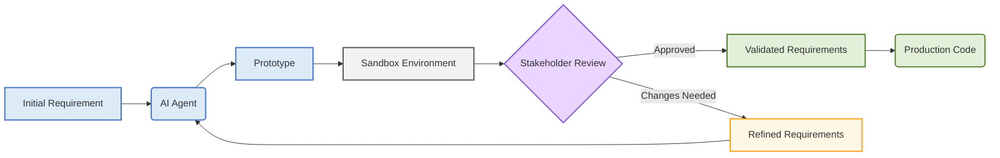

Rapid prototyping is effective for requirements discovery and alignment, allowing stakeholders with complementary expertise to explore how an aspect of a new product or an improvement to an existing one works in practice. Prototypes can also serve as partial reference implementations, encoding a meaningful subset of requirements in an unambiguous way.

In this article, I explain how to set up a static sandbox environment for “full-stack” prototypes using [Terraform](https://developer.hashicorp.com/terraform), [CloudFront](https://aws.amazon.com/cloudfront/), [S3](https://aws.amazon.com/s3/), and [Mock Service Worker](https://mswjs.io/). After covering the technical setup, I reflect on how coding agents make rapid prototyping more viable in software development.

## Basic-Auth-Secured Static File Hosting with CloudFront and S3

The prototyping environment is backed by an S3 bucket, which hosts static files (HTML, CSS, and JavaScript) and a CloudFront distribution to serve them. To prevent unauthorized access, the setup includes a simple username/password protection using a lightweight [CloudFront Function](https://docs.aws.amazon.com/AmazonCloudFront/latest/DeveloperGuide/cloudfront-functions.html).

To implement proper access control, a more robust solution like an OAuth2/OIDC proxy is a more suitable option, providing superior security, Single Sign-On (SSO), and granular access control without sharing static passwords. However, to showcase a disposable, rapid prototyping sandbox, Basic Auth is appropriate. It doesn't require external dependencies, and is easy to set up with a CloudFront Function. For this disposable environment, we're using hardcoded credentials. In any long-lived or sensitive environment, you should source these from a secure secret manager.

A single-page application (SPA) handles navigation with client-side routing. This creates a problem when you reload the page on an application route like /profile/settings, as a file with that name doesn't exist in S3, leading to a 403 Forbidden error. The custom error page configuration below instructs CloudFront to intercept any 403 Forbidden errors and serve the main /index.html file with a 200 OK status. The browser can then load the JavaScript application at any path and reloads work as expected.

Note that the cache TTLs are set to one second, effectively disabling caching to ensure users always see the latest deployed version of the prototype.

**variables.tf**

```terraform
variable "aws_region" {
  description = "The AWS region to deploy resources in."
  type        = string
  default     = "eu-west-1"
}

variable "project_name" {
  description = "A unique name for the project, used for naming resources."
  type        = string
  default     = "web-prototype-test"
}

variable "basic_auth_user" {
  description = "The username for Basic Auth."
  type        = string
  default     = "admin"
}

variable "basic_auth_pass" {
  description = "The password for Basic Auth."
  type        = string
  default     = "password"
}
```

**main.tf**

```terraform
terraform {
  required_providers {
    aws = {
      source  = "hashicorp/aws"
      version = "~> 5.0"
    }
  }
}

provider "aws" {
  region = var.aws_region
}

locals {
  auth_header = base64encode("${var.basic_auth_user}:${var.basic_auth_pass}")
}

resource "aws_s3_bucket" "site" {
  bucket = "${var.project_name}-prototype-site"
}

resource "aws_cloudfront_origin_access_control" "default" {
  name                              = "${var.project_name}-oac"
  description                       = "OAC for ${var.project_name}"
  origin_access_control_origin_type = "s3"
  signing_behavior                  = "always"
  signing_protocol                  = "sigv4"
}

resource "aws_s3_bucket_policy" "site_policy" {
  bucket     = aws_s3_bucket.site.id

  policy = jsonencode({
    Version = "2012-10-17"
    Statement = [
      {
        Effect    = "Allow"
        Principal = { Service = "cloudfront.amazonaws.com" }
        Action    = "s3:GetObject"
        Resource  = "${aws_s3_bucket.site.arn}/*"
        Condition = {
          StringEquals = {
            "AWS:SourceArn" = aws_cloudfront_distribution.cdn.arn
          }
        }
      }
    ]
  })
}

resource "aws_cloudfront_function" "auth" {
  name    = "${var.project_name}-auth-function"
  runtime = "cloudfront-js-1.0"
  comment = "Basic auth function"
  publish = true
  code = templatefile("${path.module}/auth.js.tftpl", { auth_header = local.auth_header })
}

resource "aws_cloudfront_distribution" "cdn" {
  origin {
    domain_name              = aws_s3_bucket.site.bucket_regional_domain_name
    origin_id                = "S3-${var.project_name}"
    origin_access_control_id = aws_cloudfront_origin_access_control.default.id
  }

  enabled             = true
  default_root_object = "index.html"

  default_cache_behavior {
    allowed_methods  = ["GET", "HEAD"]
    cached_methods   = ["GET", "HEAD"]
    target_origin_id = "S3-${var.project_name}"

    viewer_protocol_policy = "redirect-to-https"
    min_ttl                = 0
    default_ttl            = 1
    max_ttl                = 1

    forwarded_values {
      query_string = false
      cookies {
        forward = "none"
      }
    }

    function_association {
      event_type   = "viewer-request"
      function_arn = aws_cloudfront_function.auth.arn
    }
  }

  restrictions {
    geo_restriction {
      restriction_type = "none"
    }
  }

  viewer_certificate {
    cloudfront_default_certificate = true
  }

  custom_error_response {
    error_caching_min_ttl = 0
    error_code            = 403
    response_code         = 200
    response_page_path    = "/index.html"
  }

  tags = {
    Project = var.project_name
  }
}
```

**auth.js.tftpl**

```javascript
function handler(event) {
    var request = event.request;
    var headers = request.headers;
    // The `${auth_header}` below will be replaced by Terraform
    var expectedAuth = "Basic ${auth_header}";

    if (
        headers.authorization &&
        headers.authorization.value &&
        headers.authorization.value === expectedAuth
    ) {
        return request;
    }

    var response = {
        statusCode: 401,
        statusDescription: "Unauthorized",
        headers: {
            "www-authenticate": { value: 'Basic realm="Protected", charset="UTF-8"' },
        },
    };
    return response;
}
```

## Monorepo Setup for Prototype

A dedicated monorepo isolates prototype code from production repositories, allowing for relaxed development standards, such as unmaintained dependencies and more lenient pull request checks, under the assumption that all code is disposable.

Each prototype resides in its own directory, allowing for independent toolchains and dependencies. A root-level "shell" application serves as an entry point, either listing available prototypes or routing to a specific one, since all are deployed to a shared domain.

```
/prototypes
├── feature-x/
│   ├── src/
│   ├── package.json
│   └── vite.config.ts
├── idea-y/
│   ├── src/
│   ├── package.json
│   └── vite.config.ts
/shell-app/
/package.json
/.github/workflows/deploy.yml
```

## Prototype Loader Shell

The shell application is the hub of the prototype environment. It displays a prototype selection screen and loads the selected prototype application’s entry point script. This shell mounts into a dedicated root element in the main index.html, co-existing with a separate container where the currently active prototype's UI is injected.

**index.html**

```html
<body>
  <div id="shell-root"></div>
  <div id="prototype-root"></div>
</body>
```

The shell application loads a manifest JSON file that includes metadata about prototype applications.

```typescript
interface PrototypeManifest {
  [id: string]: {
    name: string;
    js: string;
    css: Array<string>;
  };
}
```

The shell application uses two methods to determine which prototype to load. The primary mechanism is a URL query string (e.g., `?app=...`), which allows for direct, shareable links. When a prototype is loaded this way, the shell sets a session cookie with the same prototype ID. 

Once loaded, a prototype takes full control of the URL for its own client-side routing, so we cannot guarantee on preserving the “app” query string parameter. If the user then reloads the page, the shell application reloads the previously active prototype app using the session cookie.

```typescript
import React, { useState, useEffect } from 'react';
import ReactDOM from 'react-dom/client';

function ShellLoaderApp() {
  const [manifest, setManifest] = useState(null);
  const [activeId, setActiveId] = useState(null);

  useEffect(() => {
    const initialize = async () => {
      const response = await fetch('/manifest.json');
      const manifestData = await response.json();
      setManifest(manifestData);

      const urlParams = new URLSearchParams(window.location.search);
      const appFromQuery = urlParams.get('app');
      const appFromCookie = document.cookie.split('; ').find(row => row.startsWith('last_app='))?.split('=')[1];
      const initialId = appFromQuery || appFromCookie;

      if (initialId && manifestData[initialId]) {
        setActiveId(initialId);
      }
    };
    initialize();
  }, []);

  useEffect(() => {
    if (!activeId || !manifest) return;

    const prototype = manifest[activeId];

    prototype.css.forEach(cssUrl => {
      const link = document.createElement('link');
      link.rel = 'stylesheet';
      link.href = cssUrl;
      document.head.appendChild(link);
    });

    const script = document.createElement('script');
    script.type = 'module';
    script.src = prototype.js;
    document.head.appendChild(script);
  }, [activeId, manifest]);

  const selectPrototype = (id) => {
    const url = new URL(window.location);
    url.searchParams.set('app', id);
    document.cookie = `last_app=${id}; path=/`;
    history.pushState({}, '', url);
    setActiveId(id);
  };

  if (activeId) {
    return null;
  }

  if (!manifest) {
    return <div>Loading...</div>;
  }

  return (
    <div>
      <h1>Prototype Sandbox</h1>
      <h2>Available Prototypes</h2>
      {Object.keys(manifest).map(id => (
        <div key={id}>
          <h3>{manifest[id].name}</h3>
          <button onClick={() => selectPrototype(id)}>Launch</button>
        </div>
      ))}
    </div>
  );
}

const root = ReactDOM.createRoot(document.getElementById('shell-root'));
root.render(<ShellLoaderApp />);
```

## GitHub Actions Deployment Workflow

To automate deployment, I use a GitHub Actions workflow that builds and deploys only the prototypes that have changed, keeping deployment times low and scales well as the number of prototypes in the monorepo grows. Every push to the main branch triggers the workflow and follows the four steps outlined below.

First, the workflow must determine which prototype subdirectories have been modified. A simple shell script can handle this by listing the files changed in the latest commit.

Second, the workflow iterates through the list of changed prototype IDs. For each one, it navigates into the corresponding directory and runs its build command (e.g., pnpm run build). The compiled static assets (JS, CSS, etc.) are placed into a central dist directory, maintaining their subdirectory structure (e.g., `dist/prototypes/feature-x/`).

Third, the workflow must update the `manifest.json` file with the paths to the newly built assets, by downloading the existing `manifest.json` from the S3 bucket, producing a partial `manifest.json` from the changed prototypes, merging the manifest files, and saving the combined file in the S3 bucket. While the deployment workflow's method for updating the `manifest.json` file could theoretically introduce a race condition if multiple deployments run at the same time, this approach is intentionally kept simple. It aligns with the overall goal of a lightweight and disposable prototyping environment. In the unlikely event of such a collision, the problem can be easily rectified by simply rerunning the failed deployment workflow.

Last, the workflow syncs the bundled assets of the changed prototype applications (and the shell application if needed) to the S3 bucket.

## Backend Simulation with Mock Service Worker

Each prototype simulates its backend using a service worker, typically with Mock Service Worker (MSW). The service worker intercepts network requests, allowing the prototype to function as a self-contained, full-stack application running entirely in the browser. This eliminates the need for a separate backend deployment and its associated infrastructure.

For a service worker to intercept requests for the entire application (e.g., /api/...), its script file (mockServiceWorker.js) must be served from the root of the domain. An alternative, cleaner approach is to serve the worker file from a specific path and include a Service-Worker-Allowed: / HTTP header in the response. This header grants the worker permission to control the entire origin, allowing for better separation of the shared worker script from the prototype assets. This could be configured in CloudFront using a response headers policy.

For this setup, I've assumed an approach where the build process places the shared mockServiceWorker.js file at the root of the S3 bucket. While the worker script itself is shared, the request handlers that define the mock API are unique to each prototype. Each prototype's entry point script is responsible for importing its specific handlers and starting the worker.

MSW is flexible and can operate in several modes depending on the prototype's needs:
 * **Full Backend Emulation**: For complex new features lacking support in existing backend endpoints, the MSW handlers can contain actual business logic. They can manage in-memory state (simulating a database), validate inputs, and compute responses. 
 * **Reverse-Proxying**: A handler can intercept a request, augment the request body, and then use ctx.fetch() to forward the request to an actual development or staging backend. This is useful for prototyping new features on top of an existing system without deploying backend changes.
 * **Static Stubs**: The simplest mode is returning hardcoded, static responses. This is perfect for quickly mocking out simple GET requests or defining a predictable set of API responses for the prototype to work against.

```typescript
import { rest } from 'msw';

// In-memory "database" for the full emulation example
let projects = [{ id: '1', name: 'Project Titan' }];

export const handlers = [
  // 1. Full Emulation: Create a new project
  rest.post('/api/projects', async (req, res, ctx) => {
    const { name } = await req.json();
    const newProject = { id: String(projects.length + 1), name };
    projects.push(newProject);
    return res(ctx.status(201), ctx.json(newProject));
  }),

  // 2. Reverse-Proxy: Augment and forward a request to a real backend
  rest.get('/api/real-data/:id', async (req, res, ctx) => {
    const originalResponse = await ctx.fetch(`https://api.staging.example.com/data/${req.params.id}`);
    const data = await originalResponse.json();

    // Augment the response with extra prototype-specific data
    const augmentedData = { ...data, prototype_metadata: 'injected by MSW' };
    return res(ctx.json(augmentedData));
  }),

  // 3. Static Stubs: Return a hardcoded user profile
  rest.get('/api/user', (req, res, ctx) => {
    return res(
      ctx.status(200),
      ctx.json({
        firstName: 'Jane',
        lastName: 'Doe',
        isAuthenticated: true,
      })
    );
  }),
]; 
```

## The Strategic Value of Rapid Prototyping

The previous sections laid out the technical foundation for an isolated prototyping sandbox. Now, let's explore the strategic value of this approach. In any complex software project, the greatest risks aren't purely technical; they are risks of miscommunication, misaligned assumptions, and wasted effort. Rapid prototyping directly targets these issues, transforming it from a simple "demo" into a crucial tool for communication and risk mitigation.

A project's lifecycle often begins with static documents: product briefs, Figma designs, and technical specifications. While essential, translating these abstract materials into a shared, accurate mental model across a diverse team of engineers, designers, and stakeholders is a slow, error-prone process. It requires deep concentration to develop an intuition for how the final product will actually function. An interactive prototype bypasses this challenge entirely. It acts as a common language, allowing everyone to see, click, and experience a feature firsthand. Sharing a working prototype is a far more effective way to arrive at a shared understanding, generating faster, higher-quality feedback and ensuring the entire team is aligned on the goal.

Ambitious projects are inherently risky. They risk overrunning budgets, missing deadlines, and failing to meet market needs because they were built on unfounded assumptions. Rapid prototyping is a tool to de-risk this process by isolating and validating foundational ideas early. Instead of waiting for a production-grade iteration, a team can build a feature-complete prototype for one specific aspect of the system. This artifact serves as an unambiguous reference implementation, leaving no room for misinterpretation when you can interact with the logic directly. This process validates the most critical assumptions before significant engineering resources are committed, directly lowering the risk of costly rework down the line.

## How Coding Agents Changed the Calculus for Rapid Prototyping

Until recently, rapid prototyping may have been considered too costly as part of the regular product development process. Every prototype still comes with a price tag, and because organizations optimize for efficiency, engineering bets must be carefully calibrated. Investing significant resources into what might be a "throwaway" artifact has often felt counterintuitive.

Coding agents have brought the cost of building prototypes down. This fundamental shift in the economics of development means multiple variants can now be quickly produced and experimented with, a practice that was previously too expensive to consider.
Unless carefully supervised, coding agents often produce code unsuitable for production. While they struggle with production-grade systems, they excel at creating disposable prototypes. Because they are now accessible to non-technical people, anyone can see for themselves that agent-developed applications can be brittle. However, while they may require careful supervision for production work, they are ideal for disposable and small-scale prototypes. For a given prototype, it suffices to focus on a specific aspect of the overall requirements. As long as the prototype communicates its core purpose, the other mismatching or irrelevant aspects in its implementation can be dismissed.

We must treat the output not as "pre-production code," but as a disposable requirements-engineering artifact. Its value is not in the code itself, but in the knowledge, feedback, and stakeholder alignment it generates. After developing a seemingly functional prototype, the temptation to reuse its code for the production implementation is strong but misguided. Doing so can mislead non-technical stakeholders about progress and risks introducing brittle, unvetted code into a production system.

To enforce this disposable-first mindset, a dedicated and isolated prototype environment is essential. A separate repository acts as a necessary firewall, with its own relaxed rules for dependency management and less stringent pull request checks. This technical and cultural separation makes it clear to everyone that all code in this repository is temporary and unmaintained. It helps engineers safely switch between the creative freedom of prototyping and the disciplined rigor of building production software, ensuring the valuable artifacts they create serve their purpose without compromising the quality of the final product.

## Conclusions

In complex software projects, developing a shared understanding of requirements and validating foundational assumptions often requires time-consuming production iterations. While building prototypes to test ideas has always been a pragmatic approach, it may have been prohibitively expensive, especially when writing disposable prototype code.

Tools like Terraform, CloudFront, and S3 can create a fully isolated sandbox environment from a simple configuration. Combining Mock Service Worker, a dedicated prototype repository, and GitHub Actions, the sandbox allows teams to showcase emulated full-stack prototypes without the overhead and security implications of maintaining a real backend. This technical solution provides the necessary firewall between experimental and production-grade work.

While coding agents may not yet accelerate the authoring of complex production systems, they are fit for iterating disposable prototypes. By adopting a mindset that treats prototypes as requirement-engineering artifacts, teams can de-risk their development process. Adopting this efficient rapid prototyping model accelerates the product development feedback loop, ultimately requiring fewer production-grade iterations before delivering real value to users.
