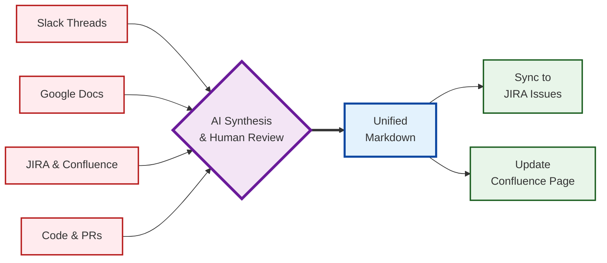

Tracking software requirements and communicating effectively with all stakeholders when information is scattered across multiple systems like Slack, Google Docs, JIRA, Confluence, GitHub, and elsewhere can be challenging. While [I wait for the industry to solve this](https://terolaitinen.fi/speccing-ai-assisted-software-requirements-engineering), I experiment with makeshift solutions. My current workflow uses [Cursor](https://www.cursor.com/)  as the central hub. It operates on a requirements-focused GitHub repository that consolidates the relevant software-focused repos as submodules, copies of Slack threads, and Google Docs. I then use MCP to sync the remaining information.

Note: the diagram above is a simplified illustration of how I gather requirements engineering context from multiple sources into Cursor and then sync back to the authoritative knowledge hubs. I want to emphasize that every step of the process combines some automated tooling with deliberate, manual curation to avoid introducing problems into the process.

## Repository Structure and Organization

The dedicated Git repository contains Markdown-formatted requirements documents, manually extracted documents from Slack and Google Docs, and Git submodules.

```
requirements-repo/
├── project-alpha/
│   ├── README.md              # High-level overview
│   ├── technical-spec.md      # Detailed technical requirements
│   ├── api-design.md          # API specifications
│   └── slack/                 # Mirrored Slack conversations
├── project-beta/
│   ├── README.md
│   ├── google/                # HTML exports from Google Docs
├── submodules/
│   ├── backend-api/           # Git submodule
│   ├── frontend-app/          # Git submodule
│   └── shared-lib/            # Git submodule
└── .cursorrules               # AI assistant guidelines
```

Markdown files in project directories include impactful high-level system design topics touching multiple software repositories, stakeholders, and teams. Folders containing manually duplicated external content (`slack/`, `google/`) provide contextual input for AI processing.

## Document Formatting Standards

Each requirements document follows standardized formatting, encoded in Cursor rules:

  - H1 title defining the document's purpose
  - Introductory paragraph summarizing the scope
  - "Related Documents" section with relative Markdown links
  - Hierarchical sections using H2/H3/H4 headers
  - Cross-references using relative paths
  - Code references using permanent GitHub links with commit hashes
  - Deduplicated content, avoiding redundancy and improving document maintainability and readability

GitHub's built-in capability to render [Mermaid diagrams](https://mermaid.js.org/) proves valuable for visualizing complex processes and data flows. The platform's inline editor enables quick fixes without requiring local development environment access. In case a review process is needed for more controversial changes, pull requests can be used.

Individual documents should be short, use simple language, and be mindful of the intended audience. For example, a top-level document can give an overview and link to more specific documents (one for frontend-specific topics, another for backend-specific topics, etc.).

## Slack, the Destroyer of Information

I would expect that an average corporate Slack instance holds an impressive amount of highly valuable information. Yet, some of it may reside in private channels or worse, hidden in direct messages between individuals, making it inaccessible to MCP tools. Even in public channels, insightful contributions may be lost in a thread with dozens of messages. Finding the relevant pieces of information later for a given issue may not be straightforward. Slack's data retention policies vary, but it may be safer to assume that messages will not be available forever. 

There is an [MCP server for Slack](https://github.com/korotovsky/slack-mcp-server), but I have not experimented with it. Models seem to struggle when the number of active MCP commands exceeds a limit. Cursor has complained when the number of MCP commands exceeds 40. I've enabled only the ones I care about in [GitHub](https://github.com/github/github-mcp-server) and [Atlassian](https://github.com/sooperset/mcp-atlassian) MCP servers, but it's still at the limit. Toggling MCP servers on and off depending on what I need could be an option, but it feels like a chore. So, I keep a static active set and then sync the rest of the information manually. Recently, Cursor has introduced a native GitHub integration, perhaps eliminating the need to use the GitHub MCP server.

In any case, given that some of the information in private channels or DMs may be intentionally intended for a smaller audience, curating messages manually and trimming potentially sensitive parts is essential, so automated MCP-based scraping is not an option for all cases. I can just copy-paste messages to a text file, read it through quickly, and formulate the information to be added to the repo. Models that do not store or leak data can be used to extract relevant information while leaving out the potentially sensitive parts.

## Google Docs, the Ultimate Document Collaboration Platform

Google Docs currently has the best possible collaboration workflow for co-authoring documents. My only gripe has so far been that the number of comments in a document can grow unwieldy. Unless comments are actively processed and incorporated into the main document, valuable insights and contributions may eventually be lost even if they are technically included in the document. Manually extracting all relevant bits of information from comments can be laborious, and it may be unclear whether it always pays off to be thorough in resolving comments. Extracting a Google document along with its comments as a read-only context artifact may thus give a second chance for comments that may not have gotten full attention in the initial treatment.

There are MCP servers for Google Docs, but I have not experimented with them. Instead, I've simply used "Download as HTML," which also includes the comments, and added the HTML file as-is to the repository.

## Confluence and JIRA, the Corporate Information Hub

Confluence is a typical place for storing hierarchically organized and cross-linked documents in an organization. The editor works well enough for individual authoring, and the commenting capabilities work quite well. JIRA, the project management part, while relatively complicated and occasionally slow, can be customized to cover most imaginable use cases.

Since I started using the Atlassian MCP server, I've enjoyed interacting with Confluence and JIRA significantly more. I can issue complex search queries in Cursor and have it trawl issues and documents for a specific purpose. Filling in JIRA issue descriptions from Cursor is smooth. For example, I can ask Cursor to analyze an existing implementation, then describe the general shape of the improvement or refactoring desired, and have it prepare a more detailed description for the corresponding issue.

Syncing documents to and from Confluence works quite well, extracting information from Confluence better than pushing Markdown-formatted documents back to Confluence. I have had difficulties syncing nested bullet point lists back to Confluence, so I've had to instruct Cursor not to create such documents.

## Git Submodules and Pull Requests

Most projects do not start from scratch. Instead, the requirements are layered on top of an existing system, assuming that all stakeholders understand the relevant aspects of the existing implementation to a satisfactory degree considering their role. Existing documentation helps less-seasoned colleagues understand the context, but documents drift out of date quickly after being published or revised. The source code and the related assets act as the only source of truth. While the exact nature of how a certain aspect of a non-trivial system works is ultimately extremely challenging to assess with high confidence, the source code unambiguously defines the product's features and capabilities, both explicitly and implicitly. The explicit part—how the implementation is wired, control flows, data structures, dependencies, and different subsystems—can be analyzed in isolation and aggregated into a human-language high-level description with AI tools, and these descriptions may help in drafting requirements for further modifications or extensions to the system.

A given project is associated with some source code or asset Git repositories. A GitHub repository holding the requirements for the project can include submodule links to the relevant repositories. When working on the requirements, specific versions of the source code repositories can be cloned under the active Cursor workspace, making it possible to reference source code or mock data when working on the requirements. If a relevant portion of source code is not yet included in the main branch, using the GitHub MCP (or Cursor's native integration) can be an effective way to extract the relevant bits of information from a pull request.

Cursor can describe how existing implementations work considering a specific aspect of a project. Models' capability to produce correct human-language descriptions of source code has improved, but the results still have varying quality. I typically ask the model to generate links to GitHub, including a specific commit hash and line number for all descriptions in English. I can ask both Gemini and Claude to create descriptions and then ask them to cross-check the descriptions. Even with partially automated cross-referencing and asking it specifically to find mistakes in the results, manual validation is essential.

Extracting a high-level description of how the existing implementation works and producing accompanying Mermaid diagrams illustrating the most crucial aspects used to be prohibitively laborious. With Cursor or comparable tools, the process of "projecting an implementation back to its requirements space" is radically streamlined.

For more complex and long-running explorations, I've thought about instructing the agent to leave a trail of `${fileName}.agent.md` files lying around, summarizing the contents of the file, any learnings, and a piece of "memory" of what the agent thought it was doing and hoping to achieve when working on a given file. I haven't tried this yet, so it remains to be seen how well such an approach works in practice.

## Working on the Markdown Documents

With all the context in place, I can start working on the Markdown documents. When starting from scratch or working on a significant revision, I want to rely on my organic brain fully to [avoid losing my cognitive faculties](https://www.media.mit.edu/publications/your-brain-on-chatgpt/). You could say that it's fine; it's just like when calculators appeared: humans no longer needed to make complex calculations in their heads, and this skill has withered. However, I find that language is fundamental to human intellect. We accept that physical exercise is essential for health, even when machines can move us and lift things for us. In the same way, it probably makes sense to regularly exercise our mental muscles, especially when we can outsource more of our thinking to AI.

I can keep the manually written document untouched in a separate read-only context file so that models don't go off on a tangent on the requirements. Once everything I can think of is in place, I can let the agents loose. Gemini and Claude have slightly different writing styles and tend to rewrite each other's outputs unless specifically instructed not to. Gemini may be more suitable for exploring gaps in requirements and speculating about tangentially relevant aspects. Claude seems more focused on capturing the essential requirements succinctly.

After a few iterations and revisions, I can have a long document with some gems and some garbage. I ask it to edit it for logical consistency and readability a few times until it stabilizes. If the document is too long or contains material for multiple audiences, I can interactively explore different ways to split it. When splitting a document, the challenge is how much information to duplicate between documents so that the end result is readable and easily navigable. Some duplication can be acceptable because models can update relevant sections in multiple files when revising requirements. Alternatively, some sections can be canonicalized in a specific document. This approach gives that document an explicit source-of-truth status for a given sub-topic. The model can then be asked to link to this canonical document with an accompanying summary.

Pushing directly to main can be a pragmatic approach in a GitHub repository with little traffic. Alternatively and additionally, pull requests are a pragmatic method for co-authors to suggest their revisions. Pull requests' commenting capabilities can be helpful for aligning on the final format. GitHub's web application's text editor works for quick minor revisions.

## Back to Confluence and JIRA

After working on the requirements documents, compiling a summary of the requirements back to Confluence can be relevant for discoverability, with links back to the GitHub repository's relevant portions. Mermaid diagrams may not render out of the box in Confluence, so these may remain in GitHub. Also, formatting issues can prevent syncing the exact Markdown contents back to Confluence, so a high-level summary may be more appropriate.

Once the requirements have been validated to a sufficient degree, I can create JIRA issues with detailed descriptions directly from Cursor. Requirements documents, code, and JIRA issue descriptions may drift out of sync, so adding links to relevant requirement documents and code repos can be helpful.

## Conclusion

Working on requirements seemingly offers the biggest leverage in software engineering. Production-grade implementation iterations are costly, so the fewer we need to cover gaps and revise unfounded assumptions in requirements, the shorter the time-to-market and the lower the total cost of ownership we can have for the software.

My experience with Cursor has shown that it can serve as a convenient and effective tool for including and tracking relevant context for requirements documents and syncing back to Confluence and JIRA.

I expect best practices and more fit-for-purpose tools to emerge in the industry in the long run. In the meantime, I continue trying out different approaches and doing my best in capturing the most critical requirements when it matters.
