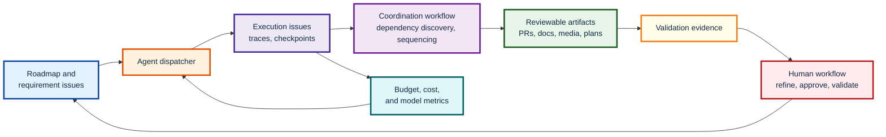

I currently use agents either directly in a synchronous terminal session or through a custom orchestrator that synchronizes its state to GitHub issues in my personal repository. This works well enough for a personal workflow. I can alternate between periods of deep focus and sustainable context switching while still getting value from parallel agents.

That is not the same as organizational infrastructure. A custom orchestrator is tuned to one person's habits, repositories, permissions, cost tolerance, and preferred failure modes. It is inefficient if every engineer has to hand-roll a similar system or choose the closest off-the-shelf approximation. Foundational capabilities such as tracing, cost accounting, dependency discovery, and validation evidence should be shared, measured, improved, and governed at the organizational level.

The following is not a complete product specification. It is an intentionally selective set of requirements for a future system superior in many ways to hand-managing agents or running a personal orchestrator. The feature selection is partly arbitrary, but the direction is defined by three metrics:

- The return on investment for human attention, divided between refining specifications and validating results.
- The accuracy of agentic workflows, more specifically the post-convergence one-shot success rate: after the task is scoped and automated or agentic quality gates have converged, the human accepts the result without requesting revisions.
- The return on organizational spend across deterministic workflows, agentic workflows, storage, and other supporting infrastructure.

The second metric needs a correctness counterweight. A system that merely trains reviewers to ask for fewer revisions is not improving. Post-acceptance defects, rollbacks, incidents, and later correction PRs should feed back into the accepted artifact and the agent workflows that produced it. Automated post-mortems can identify failed validation gates and revise previously accepted issues as failed cases, correcting the success metric after the fact.

I have not used such a system. The bottlenecks may turn out differently in practice. Still, the shape seems useful to describe: a project-management-integrated multi-agent dispatcher whose core job is to coordinate parallel agentic work, preserve complete operational traces, manage budgets, and present reviewable artifacts to humans with enough validation evidence that additional validation rounds become rare.

[NotebookLM Explainer Video in YouTube](https://youtu.be/GcEFVfxUgO0)

## Project-Management Integration

Agentic workflows should integrate into an organization's existing project-management system rather than replace it. The methodology can fit many systems: GitHub Issues, Linear, JIRA, Azure DevOps, or a custom internal platform. The important property is that agentic work is represented in the same graph where roadmap goals, requirements, milestones, ownership, prioritization, and delivery state already live.

The system should attach structured metadata to project-management objects and create additional linked objects when needed. A useful taxonomy is:

- Requirement issues describe desired outcomes, constraints, roadmap goals, product decisions, or technical goals.
- Execution issues represent agent runs and preserve their operational traces, checkpoints, budgets, discovered context, and emitted dependency claims.
- Artifact issues represent human-reviewable outputs such as pull requests, design documents, migration plans, screenshots, videos, generated reports, or sets of pull requests that together implement an atomic multi-repository change.
- Validation issues represent the work of deciding whether an artifact is correct enough to accept, including the evidence needed to make that decision.

The canonical unit of human work is not the agent execution. It is the artifact being reviewed. Agent executions are preserved because they make the system observable, debuggable, optimizable, and resumable. Humans should not usually spend time staring at raw traces. They should see summaries, dependency claims, cost summaries, validation evidence, and the next high-value decision.

## Agent Dispatch

Before an implementation task is dispatched, roadmap goals and requirement issues should be decomposed into a directed issue graph according to the organization's process. Agents should carry out much of the iterative decomposition, refinement, and cross-linking, with humans validating the decisions that matter.

Once a task is clear enough to attempt, the dispatcher launches one or more agent executions. The decomposition granularity depends on task complexity, blast radius, model capability, repository topology, and the organization's preference for reviewable artifact size.

Each execution issue should preserve complete operational traces at the lowest practical level: prompts, messages, inter-agent coordination, tool calls, files read, retrieved context, edits, diffs, logs, checkpoints, token counts, cost accounting, validation evidence, emitted dependency claims, and decisions made along the way. These traces are not primarily for human browsing. They are the substrate for observability, replay, debugging, cost optimization, model evaluation, context selection, and cross-agent coordination.

Complete traces create obvious privacy and security risks. They may capture secrets, personal data, private-channel context, regulated information, or sensitive business material. This post does not try to specify the full privacy architecture, but an organizational system would need appropriate solutions for access control, redaction, retention, deletion, auditability, data classification, and secret handling.

The same applies to execution safety. Dispatching agents that can call tools, read files, edit code, and open artifacts requires sandboxing, credential scoping, network controls, branch or workspace isolation, approval gates for destructive actions, and provenance for agent-authored changes. These are core organizational requirements, but they are table stakes for the coordination system rather than the main novelty of this post.

## Cross-Agent Coordination

The primary collaboration problem is not humans chatting with agents. It is parallel agents discovering shared dependencies while working on different parts of the organizational issue graph.

If two agents are working on related tasks, the system should discover the relationship from their traces, artifacts, touched files, retrieved context, issue links, dependency claims, and partial goal states. The system can then derive higher-level links in the project-management graph and surface them to the humans subscribed to the affected work. This has to be calibrated carefully. A naive system could fully cross-link the organization's issue graph and produce no useful signal. The goal is to maximize signal-to-noise ratio, not to route every discovered relationship to every person.

Sequencing dependent changes is the central optimization. Sharing discovered context, avoiding duplicated work, and preventing conflicting pull requests are important because they help dependent changes land in the right order. In the software implementation case, the output should often be a clean dependency graph of pull requests where merge conflicts are the exception. In the general case, the output is a clean dependency graph of reviewable artifacts.

One tempting implementation is to inject summaries from one active agent into another active agent's context window. Sometimes that may be appropriate, but it can also pollute context, waste tokens, create duplicate work, or cause temporarily divergent interpretations of the goal state. The default should be checkpointed coordination. Related agents pause at checkpoints, a lightweight coordination workflow compares their goal states and dependencies, and each agent resumes with only the minimal relevant update.

The coordination workflow may determine that no suspension is necessary. Agents can continue independently if their work is compatible, or one can stack on the other's expected artifact. The important requirement is not that all related work stops. It is that dependency discovery, sequencing, and goal-state reconciliation happen deliberately and cheaply.

## Human Workflow

The human-facing interface should be a personalized workflow, not a message stream. It should show what a person needs to see, ask for what the system needs from that person, and preserve as much deep focus and flow as possible. It can be gamified if that keeps engagement high, but the game mechanic should serve the work rather than become another source of noise.

The dashboard should batch related decisions to reduce context switching. It should present one high-signal decision at a time with enough curated context for the human to act without visiting external systems in most cases. The decisions may include:

- refining a requirement or task,
- approving or adjusting a budget,
- resolving a dependency or priority conflict,
- validating a reviewable artifact, or
- accepting that the provided validation evidence is sufficient.

Personalization should come from active subscriptions, ownership, roadmap goals, issue dependencies, business and technical metrics, and the user's access rights. Sensitive context can be shown to a user who is allowed to see it without exposing the same context to others. This is especially important for information derived from private channels, direct messages, confidential documents, or restricted operational data.

The system should help define goals, identify milestones, chart critical paths, and route human attention toward decisions with the highest expected impact. It should also avoid pretending that all attention can be measured precisely. Human cost accounting can expose sensitive salary information if handled naively. The useful organizational metric is where attention is spent and what decisions it enables, not individual surveillance.

## Validation

Validating agent-generated work consumes much of the remaining human attention. The system should constantly optimize toward reducing manual testing and reducing the number of additional validation rounds requested by humans, while tracking whether accepted artifacts later prove faulty.

An artifact should arrive with enough validation evidence for the reviewer to form an accurate estimate of correctness and risk. The exact evidence depends on the artifact. It may include deterministic checks, agentic review convergence, generated walkthroughs, screenshots, screen recordings, traces, simulations, rollout plans, risk summaries, before-and-after comparisons, or other domain-specific proofs. The important property is not the media type. The important property is validation accuracy: can a capable human decide whether the artifact should be accepted without asking for another round of proof?

Automated quality gates, deterministic checks, and agentic reviews should converge before human validation is requested. Manual testing should generally not be required for most tasks. When it is required, the system should treat that as useful feedback: either the artifact was unusually risky, the validation evidence was insufficient, the automated gates were weak, or the requirement was not specified well enough.

The system should also track post-acceptance correction signals: escaped defects, rollbacks, incidents, reopened issues, follow-up fixes, and review findings that should have been caught before acceptance. Automated post-mortems can connect those failures back to the relevant requirements, execution issues, validation gates, model choices, and reviewable artifacts. If a supposedly successful artifact later required correction, the metric should be revised rather than preserved as a success forever.

Validation tasks can be represented as linked issues and routed according to organizational policy. The scheduling model can optimize for delivery time, regression risk, knowledge sharing, availability, and workload. The details are organization-specific. The general requirement is that human validation becomes scarce, high-signal work rather than repetitive reconstruction of what the agents already attempted.

## Cost Tracking and Budgeting

All agentic work should include an at-a-glance expense view. Costs should include model calls, deterministic compute, storage, indexing, validation workflows, and any other infrastructure spend required to produce or validate the artifact. Costs attributed to shared execution issues should be allocated back to the relevant parent issues or artifacts.

The goal is not merely to spend less. The goal is deliberate capital allocation. An organization should understand what it gets in exchange for agentic and deterministic spend, then place engineering bets according to expected return under explicit assumptions.

Requirement issues can include abstract estimates of organizational value: revenue opportunity, risk reduction, compliance value, operational leverage, strategic importance, or another locally meaningful proxy. These estimates will be imprecise. That is acceptable if the system treats them as decision support rather than false precision. Combining approximate value annotations with realized cost helps the organization reason about return on organizational spend.

Before expensive work is dispatched, the system should estimate cost and uncertainty. The human operator or organizational policy can set a soft budget limit. If the limit is exceeded, the execution should suspend at a checkpoint with meaningful intermediate results. Over-budget requests can be routed according to the organization's approval policy.

The system should also learn from estimation error. If a class of tasks repeatedly costs more than expected, the dispatcher should improve its estimates, adjust decomposition, pick different models, strengthen validation gates, or ask for better requirements before launching expensive work.

## Model Selection

Automated model selection is an optimization layer, not the foundation. The foundation is shared dispatch, coordination, observability, validation, and budgeting.

Once the implementation task is adequately specified, the system can select an appropriate model or model team according to task difficulty, blast radius, criticality, model availability, recent model performance, cost, context requirements, and historical outcomes. The post-convergence one-shot success rate is a useful outcome metric because it connects model choice to the human review burden after automated gates have done their work.

The system should be able to run controlled experiments with multiple models, prompts, reviewer configurations, and coordination strategies. The comparison should use fair accounting. A more expensive configuration may be correct if it improves value per unit of organizational spend. A cheaper configuration may be wrong if it merely shifts work back to humans through additional validation rounds.

## Organizational Learning

If implementation work is increasingly carried out by agents, organizations still need humans who understand technical constraints. Requirements and implementation feasibility are intimately connected. People writing, refining, or approving requirements need enough technical intuition to know what kinds of systems can be built, what tradeoffs matter, and which constraints are likely to shape the final product.

A shared multi-agent development system can therefore include a learning layer. It can identify foundational skill gaps, recommend small learning tasks, route people toward unfamiliar systems, and expose bus factors or overloaded knowledge areas. This is not the core dispatch mechanism. It is the organizational learning loop around it.

The same applies to validation. Better technical understanding improves the quality of artifact review, but the benefit is broader than validation. It also improves requirement specification, project decomposition, risk assessment, and the ability to judge whether an agent's proposed path is feasible.

## Non-Goals and Limits

This system does not need to replace the existing project-management tool. It should integrate with whatever system the organization already uses for planning, delivery, ownership, and review.

It does not make humans inspect raw traces. Complete traces should be available when needed, but summarized by default. The ordinary human workflow should operate over artifacts, decisions, evidence, and summaries.

It does not guarantee correctness. It should improve validation accuracy, reduce manual testing, reduce validation rounds, and make failures easier to diagnose. Some tasks will still require human judgment, manual exploration, or domain-specific checks that are hard to automate.

It does not eliminate organizational policy. Budget approvals, privacy boundaries, reviewer selection, scheduling, and escalation paths should follow the organization's existing governance model.

It is also not an exhaustive requirements document. The requirements above are a selective sketch of what seems most important if agentic development becomes shared organizational infrastructure: cross-agent coordination, project-management integration, complete operational traces, human-attention optimization, validation evidence, budgeting, model selection, and organizational learning.

## Existing Tools for Organizational Multi-Agent Development

I intentionally drafted the requirements above before surveying the available tools. For this review, I looked for systems that match at least one of the core requirements: asynchronous coding agents, project-management or code-host integration, parallel execution, subagent coordination, traceability, validation evidence, usage or cost accounting, enterprise controls, or agentic review. I used primary sources where possible: official product pages, official documentation, and research papers. I left out leads I could not verify from a primary source.

The target here is broader than a coding agent. It is project-management-integrated organizational infrastructure for dispatch, coordination, validation, observability, budgeting, and human decision routing.

As of June 2026, no single system appears to implement the full shape described in this post. The state of the art is a set of strong partial matches. The closest products either manage agents as an organizational control plane or automate some version of ticket to agent session to branch or pull request to review. The missing layer is still an organizational coordination graph that treats agent runs, dependencies, artifacts, validation, budgets, and post-acceptance outcomes as one shared project-management system.

### Closest Product Systems

[Paperclip](https://paperclip.ing/) is the most direct control-plane match I found. It is open source and self-hosted, and it explicitly frames itself as an app for managing AI agents at work rather than as another agent runtime. Its public materials describe bring-your-own-agent support, org charts, reporting lines, goals, heartbeats, tickets, budgets, cost tracking, governance approvals, pause/resume/terminate controls, full tool-call tracing, and audit logs. The [GitHub README](https://github.com/paperclipai/paperclip) goes deeper: issues can carry company, project, goal, parent, and blocker links; task checkout and budget enforcement are atomic; runs produce structured logs, cost events, session state, and audit trails; workspaces can use git worktrees and operator branches; secrets are scoped to runs; and one deployment can isolate multiple companies.

This is very close to the desired execution and governance layer. The remaining gap is that Paperclip appears to model its own company and task system, while this post assumes integration into an organization's existing project-management graph. Paperclip's README says bring-your-own-ticket-system support is on the roadmap. Public materials also do not yet show the full artifact-generic validation loop, post-acceptance defect feedback, requirement-level value accounting, or checkpointed cross-agent dependency reconciliation described here.

[Linear Agents](https://linear.app/agents), [GitHub Copilot cloud agent](https://docs.github.com/en/copilot/how-tos/use-copilot-agents/cloud-agent/start-copilot-sessions), [GitLab Duo Agent Platform](https://docs.gitlab.com/user/duo_agent_platform/), and [Atlassian Rovo Dev](https://www.atlassian.com/software/rovo-dev) are the closest matches from existing planning and delivery systems. Linear makes agents assignable workspace members. GitHub already owns issues, branches, pull requests, checks, reviews, merge policy, auditability, billing, and now [Agent HQ](https://github.blog/news-insights/company-news/welcome-home-agents/) plus the dependency-aware Copilot CLI [`/fleet`](https://docs.github.com/en/copilot/concepts/agents/copilot-cli/fleet) primitive. GitLab's [Developer Flow](https://docs.gitlab.com/user/duo_agent_platform/flows/foundational_flows/developer/) operates directly over issues, discussions, and merge requests. Rovo Dev is strongest where Jira and Confluence are the system of record.

These products matter because they already sit on the graph where teams plan, review, merge, audit, and report work. Their shared gap is that public materials still show lifecycle-integrated agent sessions more than a complete requirement, execution, artifact, validation, budget, dependency-reconciliation, and post-acceptance feedback model.

[Augment Cosmos](https://www.augmentcode.com/product/cosmos), [Devin](https://docs.devin.ai/integrations/overview), [Cursor Background Agents](https://cursor.com/blog/linear), and [Factory Droids](https://factory.ai/product/droids) are closest from the agent-workflow side. Augment frames Cosmos as agentic software development at organizational scale, with triage, authoring, review, verification, reusable expert templates, organization knowledge, human-in-the-loop escalation, scheduling, isolation, integrations, replayable runs, audit logs, and enterprise policy controls. Devin, Cursor, and Factory all support some version of issue or task to autonomous session to pull request, with team workflows, codebase context, review loops, and integrations into project-management or communication tools.

These systems are closer to productized agent teams than to individual coding assistants. The remaining gap is graph scope and accounting. Public materials do not yet show the full issue-type taxonomy, checkpointed dependency reconciliation, artifact-generic validation, requirement-level value attribution, and post-acceptance correction loop described here.

### Adjacent Systems

Execution and planning environments form the next layer down. [OpenAI Codex](https://openai.com/index/introducing-codex/), [Google Jules](https://jules.google/), [Claude Code](https://code.claude.com/docs/en/overview), [Replit Agent](https://docs.replit.com/references/agent/overview), and [Kiro](https://kiro.dev/) all overlap with parts of the desired system: cloud task execution, plan and diff review, subagents, telemetry, artifact generation, checkpoints, rollback, [spec-driven requirements](https://kiro.dev/docs/specs/), design documents, task plans, and [durable project context](https://kiro.dev/docs/steering/). They are relevant substrates, but they are not primarily organizational control planes over an existing roadmap graph.

AI code review and validation products cover an important part of the stack. [CodeRabbit](https://docs.coderabbit.ai/), [Greptile](https://www.greptile.com/), [Graphite](https://graphite.com/), [Qodo](https://www.qodo.ai/), [PR-Agent](https://github.com/The-PR-Agent/pr-agent), [Claude Code review](https://code.claude.com/docs/en/github-actions), and [Rovo Dev reviewer](https://arxiv.org/abs/2601.01129) all contribute to the "artifact arrives with validation evidence" requirement. They review pull requests, apply repository or organizational standards, reason over codebase context, identify requirement gaps, summarize risk, suggest fixes, support stacked or merge-queue workflows, and in some cases expose cross-repository conflict views.

These products are valuable because they reduce the cost of artifact validation. They do not by themselves solve dispatch, dependency discovery between active agents, budget-aware scheduling, post-acceptance defect attribution, or human-attention routing across the project-management graph.

Agent orchestration frameworks are another adjacent category. [LangGraph](https://docs.langchain.com/oss/python/langgraph/overview), [OpenAI Agents SDK](https://openai.github.io/openai-agents-python/), [Microsoft Agent Framework](https://learn.microsoft.com/en-us/agent-framework/), [CrewAI](https://docs.crewai.com/), [AutoGen](https://microsoft.github.io/autogen/stable/), and [OpenHands SDK](https://arxiv.org/abs/2511.03690) provide durable execution, human-in-the-loop workflows, handoffs, traces, graph workflows, telemetry, and multi-agent patterns.

These are infrastructure for building the desired system, not the organizational product itself. They can express a workflow graph, but they usually stop below the project-management layer where requirement issues, execution issues, artifact issues, validation issues, budgets, ownership, and delivery state have to stay connected.

[Amazon Bedrock Agents](https://docs.aws.amazon.com/bedrock/latest/userguide/agents.html) belongs in the same infrastructure layer from a cloud-platform angle. Its documentation covers action groups, knowledge bases, memory, monitoring, encryption, user permissions, API invocation, [step-by-step traces](https://docs.aws.amazon.com/bedrock/latest/userguide/trace-events.html), guardrails, and [multi-agent collaboration](https://docs.aws.amazon.com/bedrock/latest/userguide/agents-multi-agent-collaboration.html) with supervisor and collaborator agents. This is strong enterprise plumbing for task-oriented agent applications. It is not, by itself, a project-management-native software delivery coordinator with requirement issues, execution issues, artifact issues, validation issues, post-acceptance feedback loops, and budget/value accounting.

Protocol and interoperability work is also relevant, but below the coordination layer. [Model Context Protocol](https://modelcontextprotocol.io/specification/2025-06-18) standardizes how LLM applications connect to external context and tools. Google's [Agent2Agent protocol](https://developers.googleblog.com/en/a2a-a-new-era-of-agent-interoperability/) is about agents communicating, exchanging information, and coordinating actions across enterprise platforms and applications. These protocols make heterogeneous agent systems more plausible, but they do not by themselves create the organizational issue graph, validation accounting, budget enforcement, trace governance, or human decision workflow described here.

Observability, evaluation, and cost-tracking systems cover another part of the stack. [LangSmith](https://docs.langchain.com/langsmith/evaluation), [Arize Phoenix](https://arize.com/docs/phoenix), [Braintrust](https://www.braintrust.dev/docs), [Helicone](https://docs.helicone.ai/), and the [OpenTelemetry GenAI conventions](https://opentelemetry.io/docs/specs/semconv/gen-ai/) map strongly to the trace, evaluation, production monitoring, feedback-loop, and cost-analytics requirements.

These systems make agentic execution measurable, but they are not delivery coordinators. They usually do not decide which requirement should dispatch next, which artifact blocks which other artifact, which human should make a decision, or how a post-acceptance production defect should revise the success classification of the original agent workflow.

### Open-Source and Research Systems

[OpenHands](https://arxiv.org/abs/2407.16741), [SWE-agent](https://arxiv.org/abs/2405.15793), and [AutoGen Studio](https://arxiv.org/abs/2408.15247) are useful research references for building the substrate: sandboxed software agents, purpose-built agent-computer interfaces, multi-agent workflow prototyping, debugging, and evaluation. They are not direct matches for the product described here, but they make the lower-level agent platform more concrete.

The empirical literature matters more for this post because it defines the measurement surface. [AIDev](https://arxiv.org/abs/2602.09185), [Phoenix](https://arxiv.org/abs/2606.20243)-style multi-agent issue-resolution systems, Atlassian's [RovoDev Code Reviewer paper](https://arxiv.org/abs/2601.01129), [Jira closed-loop orchestration case studies](https://arxiv.org/abs/2604.05000), the 2026 [agent-detection census](https://arxiv.org/abs/2606.24429), and the [collaborator-versus-assistant study](https://arxiv.org/abs/2605.08017) all point toward issue, pull-request, review, test, acceptance, and merge-governance data as the right level of observation.

The strongest research signal is that merge or acceptance is not enough. [What Makes a GitHub Issue Ready for Copilot?](https://arxiv.org/abs/2512.21426) treats issue quality as a predictor of agent success. [Where Do AI Coding Agents Fail?](https://arxiv.org/abs/2601.15195) identifies failure patterns such as CI failures, large changes, duplicate pull requests, unwanted features, and agent misalignment. [Beyond Bug Fixes](https://arxiv.org/abs/2601.20109) argues that merge success does not reliably imply post-merge quality. [AgenticFlict](https://arxiv.org/abs/2604.03551) shows why integration sequencing deserves first-class attention. Together, these papers support the post's insistence on validation accounting, post-acceptance correction signals, and dependency coordination.

Repository-level context is becoming a measurable artifact too. [Configuring Agentic AI Coding Tools](https://arxiv.org/abs/2602.14690) studies context files, skills, and subagents across Claude Code, GitHub Copilot, Cursor, Gemini, and Codex, with `AGENTS.md` emerging as an interoperable standard. [Context Engineering for AI Agents in Open-Source Software](https://arxiv.org/abs/2510.21413) studies how projects provide architecture, workflow, testing, style, and policy context to agents. A shared organizational system should learn which context mechanisms improve outcomes, detect stale or contradictory instructions, and decide what context should be routed to which agent at which checkpoint.

### Gaps Against the Requirements

The first major gap is graph-level coordination. Existing tools increasingly support parallel agents, subagents, background tasks, and cloud sessions, but they usually treat parallelism as multiple independent work streams. The system described in this post wants dependency discovery between active agents to become an explicit coordination workflow: pause at checkpoints, compare goal states, derive issue links, sequence artifacts, and resume with minimal relevant context.

The second gap is artifact and issue-type generality. Current professional developer products are understandably centered on code changes and pull requests. Some support documentation, visual QA, browser automation, screenshots, recordings, design prompts, and richer artifact types. The desired organizational system treats a PR as one artifact type among many: documents, videos, images, plans, migration reports, validation packages, or multi-repository artifact sets. It also treats requirements, executions, artifacts, and validation work as separate but linked issue types.

The third gap is trace governance. Codex exposes terminal logs and test outputs. Claude Code exposes rich telemetry. Devin, Cursor, Jules, Copilot, GitLab, Augment, Factory, Linear, Rovo, and Paperclip all expose some combination of plans, diffs, logs, review comments, session state, reasoning, issue context, tool-call traces, cost events, replayable runs, or audit data. Observability products can collect traces and costs. What is still missing is a general trace model that is complete enough for optimization and postmortems while also having a rigorous privacy, retention, redaction, deletion, and access-control model.

The fourth gap is validation accounting. Code review agents are valuable because they reduce the chance of accepting broken artifacts. But the requirement here is broader: the system should minimize additional validation rounds while tracking post-acceptance correction signals. Escaped defects, rollbacks, incidents, reopened issues, and follow-up fixes should revise the success classification of the original agent workflow.

The fifth gap is cost and value attribution. Several products expose billing, usage, or cost telemetry. Some enterprise dashboards show adoption and productivity metrics. What I do not see yet is an issue-graph-native accounting model that ties model spend, deterministic compute, validation effort, and human attention back to requirement-level estimates of organizational value.

The sixth gap is human decision routing. Current products have dashboards, notifications, PR comments, IDE panels, Slack mentions, and mobile or web surfaces. The requirement here is more opinionated: a personalized, engaging, linear workflow that asks the human for exactly the decision the system needs, in the most effective format, while protecting deep focus and avoiding a cross-linked organizational attention sink.

The final gap is organizational learning. Existing tools have rules, memories, skills, knowledge bases, and repository instructions. These improve agent behavior. The requirement here is broader: maintaining the human technical intuition required for feasible requirements, good validation, and informed tradeoff decisions as implementation work shifts toward agents.

### Conclusion

The current state of the art already contains many of the ingredients: agent control planes, PM-native agent surfaces, cloud coding agents, local agents, subagents, sandboxes, pull-request automation, review automation, telemetry, usage dashboards, model selection, artifact generation, cost controls, interoperability protocols, and enterprise controls. What I do not see yet is those ingredients assembled into one project-management-native coordination system.

The distinctive missing product is not another coding agent. It is the organizational control plane above coding agents: a project-management-integrated dispatcher that observes complete agent execution traces, discovers dependencies between parallel work, sequences reviewable artifacts, manages cost and validation evidence, routes human decisions, and feeds post-acceptance outcomes back into future dispatch and validation.
