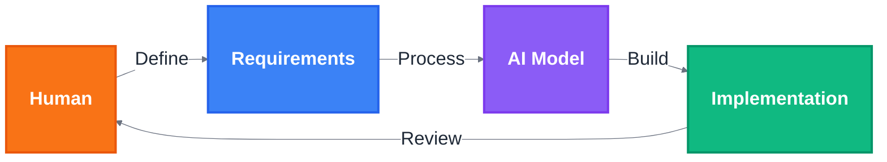

AI models increasingly cover the how of building software products, reshaping the role of software engineers. The ongoing shift may simply result in yet another abstraction layer while still requiring a “software engineer” to guide the implementation. Alternatively, the responsibilities of product managers and software engineers could gradually converge. In the latter case, a deep understanding of technology is still relevant, but most of the remaining work consists of understanding where software can add value and capturing the requirements with sufficient clarity and detail so that the AI models can derive the implementation from them.

AI providers are rushing to maximize their models’ capabilities. Predicting the rate of progress and what it means for the software industry is challenging. While we wait and see how it all plays out, we can make assumptions and reflect on how things might unfold.

What if we had abundant access to a human-level AI model? What would it imply for people currently working as software engineers?

## With Great Power Comes Great Fallibility

Current large language models operate by statistically predicting the next token given a sequence of tokens. It works uncannily well in some cases but often fails, and with great confidence. The models’ apparent inability to associate a reliable confidence level with predicted tokens renders them unsuitable for being fully responsible for authoring source code. For the time being, a human software engineer must remain in the loop and verify that the source code is consistent with the requirements.

But what if we could rely on tokens generated by a large language model? By this, I do not mean that it would be an oracle capable of correctly answering any question, including solving the Halting problem, but merely a capable software engineer that is acutely aware of the limitations of its knowledge. The capability level matters because a model that always says “I don’t know” never makes any mistakes, but it is useless for practical purposes. “Making a mistake” may also be subjective. A short and informal detour into computational complexity theory may help calibrate some intuitions. In a decision problem, the answer is either "yes" or "no". Trying to solve fundamentally hard decision problems quickly implies that mistakes are inevitable. For example, if AI model inputs are instances of an NP-complete decision problem, solving them without mistakes in polynomial time would imply P = NP. We generally expect AI models to produce an answer in polynomial time, so the problems fully solvable without mistakes must be in P.

AI models capable of producing useful software will always be inherently flawed—just as humans are—but for pragmatic purposes, a sufficient capability level paired with an acceptable error rate suffices. Speed matters, too. Throwing more computation at solving a problem tends to improve results. Provisioning computational resources costs money, so deciding how much to spend on AI models adds a new dimension of complexity to product development.

AI model capability, error rate, speed, and cost dictate the nature of work left for humans. Let’s assume that we have abundant access to human-level AI models that are fast and cheap. Ultimately, beyond a certain point, speed and cost may not constrain software development because humans will be the bottlenecks in the process.

## Defining Preferred Implementations Through Requirements

Assuming the AI models will take full ownership of the implementation work, it suffices to describe what they should build.

In principle, we can think of any software implementation we could possibly build as a sequence of tokens. The analogy is not completely unreasonable because you can [pack an entire repository](https://github.com/r-dh/repopack) into a single LLM-friendly file.

The space of possible software implementations is large. However, only a fraction of all possible implementations actually do something useful. As an example of a hard requirement, implementations including functions that do not always halt can be safely discarded. Soft requirements express preferences, allowing us to choose between two implementations. Combining both hard and soft requirements for a given project, we can define the most preferred implementations, all indistinguishable from each other as far as the requirements are concerned.

Verifying whether a hard requirement is met or assessing the degree to which a soft requirement is satisfied in a given implementation is a challenging problem in itself, but we can (magically) assume that AI will solve that part to a satisfactory degree as well.

## The New Software Development Process

Developing software with an AI that takes full ownership of the implementation will be a process of iteratively refining the requirements. After handing over a set of requirements to the AI, it will come back either with one of the most preferred implementations with respect to the requirements or explain why it is not possible to create an implementation that satisfies the hard requirements.

The software engineering problem the AI solves is underconstrained in the sense that for any set of requirements, there is an infinite number of equally good implementations. Even when the requirements consist of a reference implementation and the task is to implement the exact same software, it is possible to reorder the parts of the source code and add arbitrary subtle alterations while still being virtually identical when examining the externally observable characteristics of the implementation.

To produce a single implementation, the AI must add a large number of assumptions the requirements did not cover. In principle, the AI could stop and ask the person responsible for the requirements to check if an assumption is correct, but given how many assumptions would need to be checked, this inefficiency would sap much of the benefits of the AI-assisted development process.

The AI can absorb the industry best practices, all the organizational context, the existing implementation, and the entire history of interacting with the human counterpart. This will help the AI to make better assumptions. However, it will not be able to guess correctly every time.

Asking to confirm each assumption is impractical, so we may as well let the AI produce an implementation and then examine it interactively. The AI can walk us through the key assumptions, present the high-level system design, and we can manually test the software and look at the source code.

The source code is unambiguous. Yet, it encodes an infinite number of possible requirements expressed using human language in the sense that we can always come up with a new requirement that the implementation satisfies. Translating the implementation into a set of unambiguous human-language statements that could be restored back to the exact same source code would be an injective mapping, retaining the same level of technical complexity as the original source code.

Humans involved in the software development process where an AI is fully responsible for the implementation need not concern themselves with implementation trivialities. Only those bad assumptions made by the AI that can break a business process should be caught. Such bad assumptions can be of a technical nature or concern business logic. In either case, both deep technology and product-level understanding are essential in guiding the AI to build the right software.

## Conclusions

Software development is changing, allowing human beings to focus more on requirements engineering, possibly ultimately transferring full implementation ownership to AI. People will always want to create, so even in the presence of human-level (and beyond) AI, we still need to have helpful intuitions of what can be built—both the fundamental limitations of computation and physics, and what is feasible in the current technology landscape.

Humans will remain in the software development loop for the foreseeable future. Granted, we will increasingly be a bottleneck, slowly and clumsily elaborating on what we actually want. We will spend more and more time studying AI-built implementations—assisted by AI while doing that, of course—but it does not extricate us from understanding technology and product-level matters. In fact, it increasingly frees us from the drudgery of repetitive and mechanical transformations and allows us to focus on what truly matters.